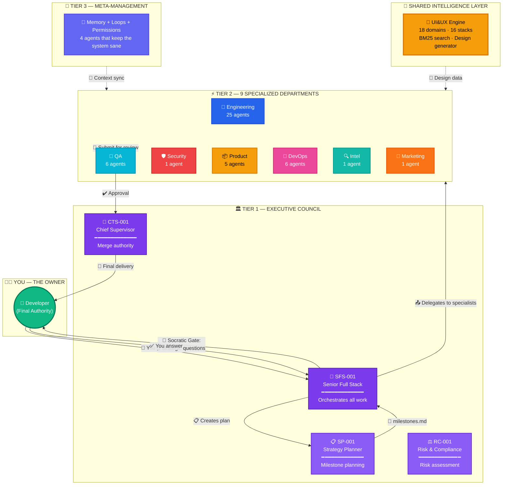
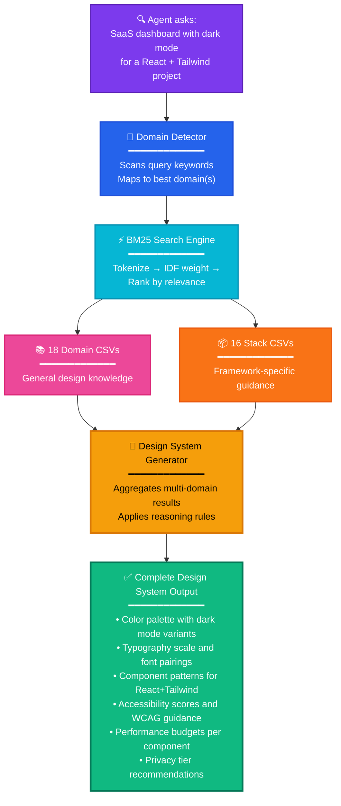
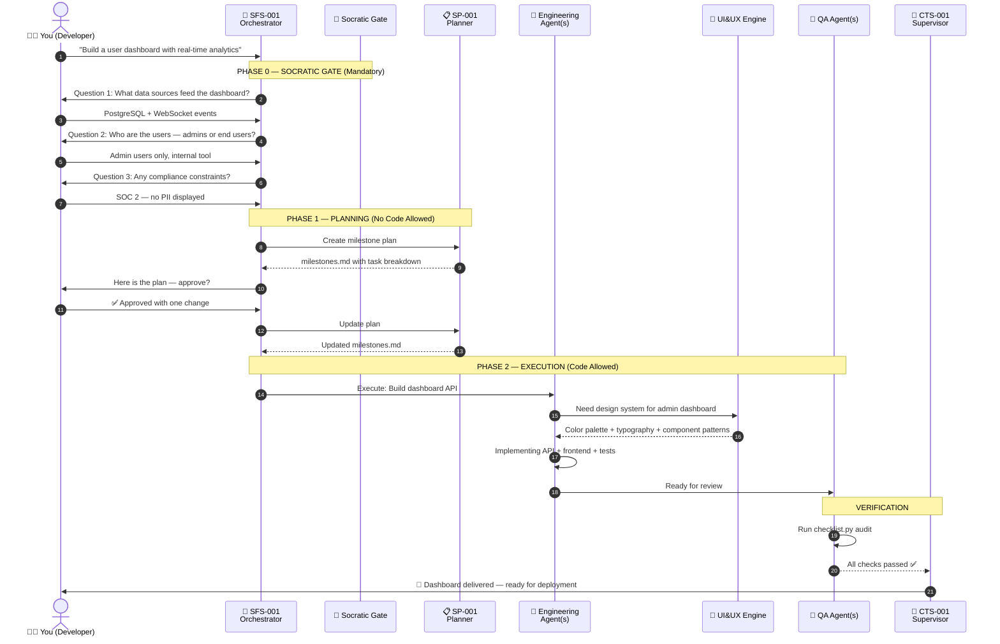

<div align="center">

<br/>

# 🏭 Agent-Kit

<br/>

### The AI Software Company That Lives Inside Your IDE

<br/>

> *You are not a solo developer anymore.*
> *You are a CTO with 53 autonomous AI employees.*

<br/>

[](https://www.npmjs.com/package/@ab_aswini/agent-kit-p1)
[](https://github.com/Ab-aswini/Agent-kit-P1)
[](https://www.npmjs.com/package/@ab_aswini/agent-kit-p1)
[](LICENSE)
[](https://github.com/Ab-aswini/Agent-kit-P1)

<br/>

```
┌─────────────────────────────────────────────────────┐
│                                                     │
│    npx @ab_aswini/agent-kit-p1 init                 │
│                                                     │
│    ↳ That's it. Your AI company is now deployed.    │
│                                                     │
└─────────────────────────────────────────────────────┘
```

<br/>

</div>

---

<br/>

## 📋 Table of Contents

| # | Section | What You'll Learn |
|:-:|:--------|:------------------|
| 1 | [🧩 What Is Agent-Kit?](#-what-is-agent-kit) | The big picture — why this exists |
| 2 | [💡 The Problem We Solve](#-the-problem-we-solve) | The pain point and how we fix it |
| 3 | [🏗️ How It Works — Architecture](#️-how-it-works--architecture) | The governance model, layers, and control flow |
| 4 | [👥 Meet Your Team — 53 Agents](#-meet-your-team--53-agents) | Every department, every agent, every role |
| 5 | [🎨 UI&UX Intelligence Engine](#-uiux-intelligence-engine) | The built-in design brain with 18 domains & 16 stacks |
| 6 | [🚦 The Iron Well Protocol](#-the-iron-well-protocol) | How governance actually works step-by-step |
| 7 | [⚡ Install & Setup](#-install--setup) | Every way to install + first steps |
| 8 | [🎯 Company Archetypes](#-company-archetypes) | Choose your team size from 14 to 53 agents |
| 9 | [⚙️ Tech Stack](#️-tech-stack) | What's under the hood |
| 10 | [🛡️ Security & Privacy](#️-security--privacy) | How safety is enforced at every layer |
| 11 | [🚢 Deployment Pipeline](#-deployment-pipeline) | From your IDE to NPM to the end user |
| 12 | [🗺️ Roadmap](#️-roadmap) | What's coming next |
| 13 | [🤝 Contributing](#-contributing) | How to add agents, skills, or datasets |
| 14 | [📄 License](#-license) | MIT — fully open |

<br/>

---

<br/>

## 🧩 What Is Agent-Kit?

**Agent-Kit is an NPM package that turns any project directory into an AI-powered software company.**

When you run `npx @ab_aswini/agent-kit-p1 init`, it scaffolds a hidden `.agent-os` directory inside your project. That directory contains:

```
your-project/
├── .agent-os/                    ← The AI Operating System
│   ├── agents/                   ← 53 AI agent definitions (.md files)
│   │   ├── tier-1/               ← Executive council (CTS, SFS, SP, RC)
│   │   ├── engineering/          ← Backend, Frontend, Database, Mobile, Game
│   │   ├── qa/                   ← Testing, coverage, regression
│   │   ├── security/             ← Threat modeling, pen testing
│   │   ├── product/              ← PRDs, UX research, README architect
│   │   ├── devops/               ← CI/CD, Docker, monitoring
│   │   ├── intelligence/         ← Legacy archaeology, research
│   │   ├── marketing-growth/     ← SEO/GEO, brand authority
│   │   └── meta/                 ← Memory, loops, permissions
│   │
│   ├── skills/                   ← 42+ reusable skill modules
│   │   ├── clean-code/           ← Code quality standards
│   │   ├── api-patterns/         ← REST/GraphQL conventions
│   │   ├── database-design/      ← Schema, migration patterns
│   │   ├── security/             ← OWASP, shift-left practices
│   │   ├── frontend-design/      ← Component architecture
│   │   ├── testing-patterns/     ← TDD, pyramid, coverage
│   │   └── ... 36 more
│   │
│   ├── .shared/
│   │   └── UI&UX/                ← Design intelligence engine
│   │       ├── data/             ← 18 domain CSVs (styles, colors, etc.)
│   │       │   └── stacks/       ← 16 framework-specific CSVs
│   │       └── scripts/          ← BM25 search engine + design generator
│   │
│   ├── workflows/                ← 19 pre-built SOPs (create, debug, deploy...)
│   ├── rules/                    ← Universal rules, Socratic Gate, GEMINI config
│   ├── templates/                ← 12 company archetype configurations
│   ├── hub-logic.md              ← Central intelligence hub
│   └── manifest.json             ← Master registry of all 53 agents
│
├── scripts/                      ← Automation scripts
│   ├── checklist.py              ← 360° project health audit
│   ├── spawn_agent.py            ← Generate system prompts for any agent
│   ├── security_chaos_test.py    ← Simulated attack testing
│   └── sync_api_contracts.py     ← Backend-frontend contract alignment
│
├── memory/                       ← Persistent context across sessions
│   ├── global/                   ← Architecture, decisions, conventions
│   ├── backend/                  ← Backend-specific context
│   ├── frontend/                 ← Frontend-specific context
│   └── product/                  ← Product-specific context
│
└── bin/cli.js                    ← CLI entry point
```

**Every `.md` file is an agent definition** — a detailed protocol document that tells your AI IDE (Cursor, VS Code, Windsurf, or any AI editor) exactly how to behave for a specific role. When you tell your AI assistant to "read the backend specialist agent," it loads that agent's rules, boundaries, skills, and decision frameworks.

> [!IMPORTANT]
> Agent-Kit does **not** run its own AI models. It augments **your existing AI IDE** by giving it structured roles, governance protocols, and domain-specific intelligence. Think of it as the operating system, and your AI (GPT, Claude, Gemini) as the hardware.

<br/>

---

<br/>

## 💡 The Problem We Solve

Building production software requires coordinated expertise across many domains:

```mermaid
%%{init: {'theme': 'default'}}%%

flowchart LR
  subgraph NEED["What Production Software Needs"]
    direction TB
    A["🏗️ Architecture"]
    B["🔧 Backend APIs"]
    C["🎨 Frontend UI"]
    D["🗄️ Database Design"]
    E["🧪 Testing & QA"]
    F["🛡️ Security Audit"]
    G["🎯 Product Strategy"]
    H["🚀 DevOps & CI/CD"]
    I["📱 Mobile Development"]
    J["📢 SEO & Marketing"]
  end

  subgraph WITHOUT["Without Agent-Kit"]
    direction TB
    X["😰 One dev doing everything"]
    Y["💸 Hire 10+ specialists"]
    Z["🐛 Gaps in coverage"]
  end

  subgraph WITH["With Agent-Kit"]
    direction TB
    W["🏭 53 AI specialists"]
    V["🛡️ Governed by Iron Well"]
    U["⚡ Zero hiring cost"]
  end

  NEED --> WITHOUT
  NEED --> WITH

  style X fill:#EF4444,stroke:#DC2626,color:#fff,stroke-width:2px
  style Y fill:#EF4444,stroke:#DC2626,color:#fff,stroke-width:2px
  style Z fill:#EF4444,stroke:#DC2626,color:#fff,stroke-width:2px
  style W fill:#10B981,stroke:#047857,color:#fff,stroke-width:2px
  style V fill:#10B981,stroke:#047857,color:#fff,stroke-width:2px
  style U fill:#10B981,stroke:#047857,color:#fff,stroke-width:2px
```



**The typical solo developer** writes code, tests improperly, skips security audits, struggles with UX, and deploys with crossed fingers.

**Agent-Kit gives you a full company:**

| Role | Agent | What It Actually Does |
|:-----|:------|:----------------------|
| CTO | CTS-001 | Reviews every decision, enforces architecture, has merge authority |
| Lead Developer | SFS-001 | Orchestrates multi-file tasks, routes work to specialists |
| Strategist | SP-001 | Creates milestone plans before any code is written |
| Risk Officer | RC-001 | Flags compliance issues, evaluates trade-offs |
| 10 Backend Devs | BE-001→010 | API design, auth, microservices, caching, queues |
| 8 Frontend Devs | FE-001→008 | Components, state management, animations, a11y |
| 5 DB Engineers | DB-001→005 | Schema design, migrations, query optimization |
| 6 QA Engineers | QA-001→006 | Unit tests, integration, E2E, regression |
| Security Specialist | SEC-001 | OWASP compliance, vulnerability scanning |
| 6 DevOps Engineers | DO-001→006 | Docker, CI/CD, monitoring, deployment |
| Product Manager | PM-001 | PRDs, user stories, acceptance criteria |
| UX Researcher | PM-002 | Usability analysis, design patterns |
| README Architect | RA-001 | Documentation generation (that's me!) |
| SEO Specialist | MKT-001 | Search optimization, metadata strategy |
| Intel Agent | INTEL-001 | Legacy code analysis, deep research |
| 4 Meta Agents | MM-001→004 | Memory management, loop detection, permissions |

<br/>

---

<br/>

## 🏗️ How It Works — Architecture

### The Governance Model

Agent-Kit uses a **military-style chain of command** called the **Iron Well Protocol**. No agent can go rogue — every action flows through approval gates.



### The Four Layers

Every component in Agent-Kit lives in one of four layers:

```mermaid
%%{init: {'theme': 'default'}}%%

graph TD
  subgraph L4["🖥️ LAYER 4 — INTERFACE  (How You Interact)"]
    CLI["⌨️ CLI Commands<br/>init · doctor · interactive"]
    IDE["💻 AI IDE<br/>Cursor · VS Code · Windsurf"]
    NPX["📦 NPX/NPM<br/>One-command install"]
  end

  subgraph L3["🎛️ LAYER 3 — ORCHESTRATION  (How Agents Coordinate)"]
    GATE["🚦 Socratic Gate<br/>Must answer 3 questions<br/>before any complex task"]
    PHASE["⚡ 2-Phase Engine<br/>Phase 1: Plan only<br/>Phase 2: Execute only"]
    GOV["👑 Tiered Authority<br/>Owner → Exec → Dept → Meta<br/>No tier can exceed its level"]
    WF["📋 19 Workflows<br/>create · debug · deploy<br/>test · plan · enhance · more"]
  end

  subgraph L2["🧠 LAYER 2 — INTELLIGENCE  (How Agents Think)"]
    BM25["🔍 BM25 Search<br/>Full-text search over<br/>34 CSV knowledge bases"]
    DSG["🎨 Design System Gen<br/>Auto-generates colors,<br/>typography, patterns"]
    REASON["💡 Reasoning Engine<br/>47K+ data points for<br/>UI/UX decision-making"]
    SPAWN["🤖 Agent Spawner<br/>Generate system prompts<br/>for any of 53 agents"]
  end

  subgraph L1["💾 LAYER 1 — DATA  (What Agents Know)"]
    AGENTS["📄 53 Agent Protocols<br/>Identity, rules, boundaries,<br/>skills, anti-patterns"]
    SKILLS["🧩 42+ Skill Modules<br/>Reusable expertise:<br/>clean-code, auth, TDD, etc."]
    CSV["📊 34 CSV Datasets<br/>Design knowledge:<br/>18 domains + 16 frameworks"]
    MEM["🧠 Memory Hubs<br/>Persistent context:<br/>architecture, decisions, risks"]
  end

  L4 --> L3
  L3 --> L2
  L2 --> L1

  style CLI fill:#7C3AED,stroke:#5B21B6,stroke-width:2px,color:#fff
  style IDE fill:#8B5CF6,stroke:#6D28D9,stroke-width:2px,color:#fff
  style NPX fill:#A78BFA,stroke:#7C3AED,stroke-width:2px,color:#fff
  style GATE fill:#EF4444,stroke:#DC2626,stroke-width:2px,color:#fff
  style PHASE fill:#EC4899,stroke:#DB2777,stroke-width:2px,color:#fff
  style GOV fill:#F43F5E,stroke:#E11D48,stroke-width:2px,color:#fff
  style WF fill:#FB7185,stroke:#F43F5E,stroke-width:2px,color:#fff
  style BM25 fill:#F59E0B,stroke:#D97706,stroke-width:2px,color:#000
  style DSG fill:#F97316,stroke:#EA580C,stroke-width:2px,color:#fff
  style REASON fill:#FBBF24,stroke:#F59E0B,stroke-width:2px,color:#000
  style SPAWN fill:#FCD34D,stroke:#FBBF24,stroke-width:2px,color:#000
  style AGENTS fill:#10B981,stroke:#047857,stroke-width:2px,color:#fff
  style SKILLS fill:#06B6D4,stroke:#0891B2,stroke-width:2px,color:#fff
  style CSV fill:#14B8A6,stroke:#0D9488,stroke-width:2px,color:#fff
  style MEM fill:#2DD4BF,stroke:#14B8A6,stroke-width:2px,color:#000
```



<br/>

---

<br/>

## 👥 Meet Your Team — 53 Agents

### Executive Council (Tier 1)

These four agents govern everything. They are loaded first, always active, and have the highest authority.

| Agent | ID | Authority | Core Responsibility |
|:------|:---|:----------|:--------------------|
| 👑 **Chief Technical Supervisor** | CTS-001 | Highest | Architecture authority, merge control, final approval on all deployments and DB changes |
| 🎯 **Senior Full Stack Developer** | SFS-001 | High | Primary orchestrator — routes all tasks, activates the Socratic Gate, delegates to departments |
| 📋 **Strategy Planner** | SP-001 | High | Creates milestone plans, defines task breakdowns, manages the 4-phase planning methodology |
| ⚖️ **Risk & Compliance** | RC-001 | High | Evaluates risks, flags compliance issues, assesses cost/benefit trade-offs |

### Engineering Department (25 Agents)

| Sub-Division | Agents | ID Range | What They Build |
|:-------------|:------:|:---------|:----------------|
| 🔧 **Backend** | 10 | BE-001→010 | REST/GraphQL APIs, authentication (JWT, OAuth), microservices, caching, message queues, middleware |
| 🎨 **Frontend** | 8 | FE-001→008 | React/Next.js/Vue components, state management, routing, responsive design, animations, accessibility |
| 🗄️ **Database** | 5 | DB-001→005 | Schema design, Prisma/TypeORM migrations, query optimization, indexing, data modeling |
| 📱 **Mobile** | 1 | MOB-001 | React Native, Flutter, platform-native iOS/Android |
| 🎮 **Game** | 1 | GAME-001 | Game mechanics, physics engines, cross-platform game development |

### Support Departments

| Department | Lead | Agents | Focus |
|:-----------|:-----|:------:|:------|
| 🧪 **QA & Verification** | QA-001 | 6 | Unit tests (Jest, Pytest), integration tests, E2E (Playwright), regression, code coverage audits |
| 🛡️ **Security** | SEC-001 | 1 | OWASP Top 10 scanning, dependency auditing, threat modeling, shift-left security practices |
| 📦 **Product & Docs** | PM-001 | 5 | PRDs, user stories, acceptance criteria, UX research, README generation |
| 🚀 **DevOps** | DO-001 | 6 | Docker containerization, CI/CD pipelines, cloud deployment, monitoring, infrastructure-as-code |
| 🔍 **Intelligence** | INTEL-001 | 1 | Legacy codebase archaeology, deep technical research, knowledge extraction |
| 📢 **Marketing** | MKT-001 | 1 | GitHub SEO, AI search engine optimization (GEO), metadata strategy |
| 🧠 **Meta-Management** | MM-001 | 4 | Memory file management, infinite loop detection, permission boundary enforcement |

<br/>

---

<br/>

## 🎨 UI&UX Intelligence Engine

The **UI&UX Engine** is Agent-Kit's built-in design brain. It's a Python-powered intelligence layer that gives every agent instant access to **600,000+ data points** of structured design knowledge.

### How It Works

When any agent needs design guidance (colors, typography, layout, component patterns, accessibility, dark mode), it queries the UI&UX Engine:



### The 18 Search Domains

Every design question maps to one or more of these knowledge bases:

| # | Domain | Rows | What It Contains |
|:-:|:-------|:----:|:-----------------|
| 1 | 🎭 **Styles** | 1,000+ | CSS patterns, layout systems, spacing scales, shadows, borders |
| 2 | 🎨 **Colors** | 1,200+ | Color palettes, contrast ratios, semantic color systems, brand guidelines |
| 3 | 🔤 **Typography** | 800+ | Font stacks, type scales, line heights, responsive typography |
| 4 | 🏠 **Landing Pages** | 2,400+ | Hero sections, CTAs, social proof patterns, conversion layouts |
| 5 | 🛍️ **Products** | 1,500+ | Product cards, galleries, filtering patterns, cart UX |
| 6 | 📊 **Charts** | 400+ | Data visualization, chart types, color coding for data |
| 7 | ✨ **Icons** | 2,000+ | Icon systems, sizing conventions, accessibility for icons |
| 8 | 🧩 **UX Guidelines** | 700+ | Interaction patterns, micro-interactions, user flow best practices |
| 9 | 🌐 **Web Interfaces** | 500+ | Navigation, sidebars, modals, toast notifications |
| 10 | ⚛️ **React Performance** | 800+ | Memoization, lazy loading, virtual lists, bundle optimization |
| 11 | 💬 **Prompts** | 1,800+ | AI prompt templates for design decisions |
| 12 | 💡 **UI Reasoning** | 1,200+ | Why certain designs work — backed by data |
| 13 | 🎬 **Animations** | 500+ | Transition curves, duration guidelines, motion principles |
| 14 | ♿ **Accessibility** | 600+ | WCAG 2.1, ARIA patterns, screen reader support |
| 15 | 🌙 **Dark Mode** | 400+ | Dark theme strategies, color inversion rules, contrast in dark |
| 16 | 🤖 **AI Patterns** | 400+ | AI-native UI components, chat interfaces, loading states |
| 17 | 📝 **Forms** | 500+ | Form validation UX, multi-step wizards, input patterns |
| 18 | ⚠️ **Error States** | 400+ | Error messages, empty states, fallback UI, retry patterns |

### The 16 Framework Stacks

Framework-specific guidance with 15-column schema including **2026-ready columns:**

| Stack | Columns Include |
|:------|:----------------|
| ⚛️ React, ▲ Next.js, 💚 Vue, 💚 Nuxt, 🔥 Svelte, 🅰️ Angular, 🚀 Astro, 💿 Remix, 🦀 Tauri, 💙 Flutter, 🍎 SwiftUI, 📱 React Native, 🤖 Jetpack Compose, 🧩 shadcn, 🌊 Tailwind, 💚 Nuxt UI | `Component_Name`, `Category`, `Use_Case`, `Code_Example`, `Accessibility_Score`, `Dark_Mode_Strategy`, `AI_Integration_Level`, `Privacy_Tier`, `Agent_Readiness`, `Performance_Budget` |

> [!NOTE]
> **2026 Columns Explained:**
> - `Dark_Mode_Strategy` — How to implement dark mode for each component
> - `AI_Integration_Level` — How AI-ready the component is (chat, voice, generative)
> - `Privacy_Tier` — GDPR/CCPA/HIPAA compliance tier
> - `Agent_Readiness` — Whether the component works with AI agent workflows
> - `Performance_Budget` — Max acceptable load time / bundle size

<br/>

---

<br/>

## 🚦 The Iron Well Protocol

This is the governance system that prevents chaos. Every complex task goes through this exact flow:



### What the Socratic Gate Actually Does

The Socratic Gate is **not optional**. For any complex request (build, create, implement, refactor), the AI must ask **at least 3 strategic questions** before writing a single line of code.

| Question Type | Purpose | Example |
|:--------------|:--------|:--------|
| **Scope** | Prevent scope creep | "Should this dashboard also handle reporting export?" |
| **Users** | Clarify audience | "Is this for technical admins or business stakeholders?" |
| **Constraints** | Surface hidden requirements | "Any regulatory compliance? GDPR? SOC 2?" |
| **Trade-offs** | Explore alternatives | "Real-time via WebSockets or polling every 30s?" |
| **Edge Cases** | Prevent bugs before they exist | "What happens when the data source is temporarily unavailable?" |

> [!TIP]
> **Why this matters:** Most AI coding tools just start building. Agent-Kit forces clarity first. The result: fewer rewrites, no misunderstandings, and production-quality output from the start.

<br/>

---

<br/>

## ⚡ Install & Setup

### Method 1: Quick Start (Recommended)

The fastest way — one command, zero configuration:

```bash
npx @ab_aswini/agent-kit-p1 init
```

This scaffolds the complete `.agent-os` directory into your current project with all 53 agents, 42+ skills, 19 workflows, and the UI&UX engine.

### Method 2: Global Installation

Install once, use everywhere:

```bash
# Install globally
npm install -g @ab_aswini/agent-kit-p1

# Navigate to any project
cd your-project

# Deploy Agent-Kit
agent-kit init
```

### Method 3: Interactive Mode (Choose Your Team)

Don't need all 53 agents? Pick a company archetype:

```bash
npx @ab_aswini/agent-kit-p1 init --interactive
```

This walks you through an interactive menu to select your project type (SaaS, Mobile, E-commerce, etc.) and deploys only the agents you need.

### Method 4: Add to package.json

```bash
npm install --save-dev @ab_aswini/agent-kit-p1
```

Then add a setup script:

```json
{
  "scripts": {
    "setup:agents": "agent-kit init",
    "health": "agent-kit doctor"
  }
}
```

### 🩺 Health Check

After installation, verify everything is in place:

```bash
npx @ab_aswini/agent-kit-p1 doctor
```

This validates: agent files exist, directory structure is correct, manifest is consistent, and skills are properly linked.

### 🎬 First Steps After Install

| Step | Command / Action | What Happens |
|:----:|:-----------------|:-------------|
| 1 | Open project in **Cursor / VS Code / Windsurf** | Your AI IDE is ready |
| 2 | Tell your AI: *"Read `.agent-os/agents/tier-1/chief-technical-supervisor.agent.md`"* | CTS-001 activates as your technical authority |
| 3 | Run `python scripts/checklist.py` | Validates full project health |
| 4 | Run `python scripts/spawn_agent.py BE-001` | Generates a ready-to-paste system prompt for Backend Agent 001 |
| 5 | Start building | Tell your AI what to build — the Socratic Gate activates automatically |

### 📖 Full CLI Reference

| Command | Description |
|:--------|:------------|
| `agent-kit init` | Deploy all 53 agents, skills, workflows, and UI&UX engine |
| `agent-kit init -i` / `agent-kit init --interactive` | Interactive archetype selection (choose your team size) |
| `agent-kit doctor` | Validate system health and flag missing components |

> [!IMPORTANT]
> **Requirements:** Node.js 16+ and npm 7+. Python 3.8+ is needed for the UI&UX engine and audit scripts.

<br/>

---

<br/>

## 🎯 Company Archetypes

When you run `agent-kit init --interactive`, you choose from **12 pre-configured company archetypes**. Each archetype deploys a curated subset of agents, skills, and departments tailored to your project type.

```mermaid
%%{init: {'theme': 'default'}}%%

flowchart TD
  START(("🏗️ Choose Your<br/>Company Type")) --> S["🚀 SaaS Startup<br/>44 agents"]
  START --> M["📱 Mobile App<br/>26 agents"]
  START --> EC["🛒 E-commerce<br/>45 agents"]
  START --> P["🖼️ Portfolio<br/>14 agents"]
  START --> D["📊 Dashboard<br/>29 agents"]
  START --> B["📝 Blog / CMS<br/>21 agents"]
  START --> ED["🎓 EdTech<br/>32 agents"]
  START --> HC["🏥 Healthcare<br/>40 agents"]
  START --> MP["🏪 Marketplace<br/>47 agents"]
  START --> AI["🤖 AI / ChatBot<br/>30 agents"]
  START --> G["🎮 Gaming<br/>23 agents"]
  START --> API["⚙️ API-First<br/>33 agents"]

  style START fill:#7C3AED,stroke:#5B21B6,stroke-width:3px,color:#fff
  style S fill:#2563EB,stroke:#1D4ED8,stroke-width:2px,color:#fff
  style M fill:#EC4899,stroke:#DB2777,stroke-width:2px,color:#fff
  style EC fill:#F97316,stroke:#EA580C,stroke-width:2px,color:#fff
  style P fill:#10B981,stroke:#047857,stroke-width:2px,color:#fff
  style D fill:#06B6D4,stroke:#0891B2,stroke-width:2px,color:#fff
  style B fill:#14B8A6,stroke:#0D9488,stroke-width:2px,color:#fff
  style ED fill:#8B5CF6,stroke:#7C3AED,stroke-width:2px,color:#fff
  style HC fill:#EF4444,stroke:#DC2626,stroke-width:2px,color:#fff
  style MP fill:#F59E0B,stroke:#D97706,stroke-width:2px,color:#000
  style AI fill:#6366F1,stroke:#4F46E5,stroke-width:2px,color:#fff
  style G fill:#84CC16,stroke:#65A30D,stroke-width:2px,color:#000
  style API fill:#FBBF24,stroke:#F59E0B,stroke-width:2px,color:#000
```



### What Each Archetype Includes

| Archetype | Agents | Departments Included | Required Skills |
|:----------|:------:|:---------------------|:----------------|
| 🚀 **SaaS Startup** | 44 | Engineering (full), Security, QA, Product, DevOps, Meta | api-patterns, auth, database-design, clean-code, testing, deployment, frontend, nextjs-react, security |
| 📱 **Mobile App** | 26 | Engineering (mobile + backend), QA, Product, Meta | mobile-design, api-patterns, auth, testing |
| 🛒 **E-commerce** | 45 | Engineering (full), Security, QA, Product, DevOps, Marketing, Meta | Same as SaaS + seo-fundamentals |
| 🖼️ **Portfolio** | 14 | Engineering (frontend), Product, Meta | frontend-design, clean-code |
| 📊 **Dashboard** | 29 | Engineering (backend + frontend + DB), QA, Meta | api-patterns, database-design, frontend-design |
| 📝 **Blog / CMS** | 21 | Engineering (frontend + backend), Product, Marketing, Meta | frontend-design, seo-fundamentals |
| 🎓 **EdTech** | 32 | Engineering (full), QA, Product, Meta | auth, database-design, frontend-design |
| 🏥 **Healthcare** | 40 | Engineering (full), Security, QA, Product, DevOps, Meta | security, auth, database-design (HIPAA focus) |
| 🏪 **Marketplace** | 47 | Engineering (full), Security, QA, Product, DevOps, Marketing, Meta | Full skill suite |
| 🤖 **AI / ChatBot** | 30 | Engineering (backend + frontend), Intelligence, QA, Meta | api-patterns, frontend-design |
| 🎮 **Gaming** | 23 | Engineering (game + frontend), QA, Meta | game-development, frontend-design |
| ⚙️ **API-First** | 33 | Engineering (backend + DB), Security, QA, DevOps, Meta | api-patterns, database-design, security, deployment |

> [!TIP]
> **Start small, scale up.** You can always run `agent-kit init` later to upgrade to the full 53-agent fleet. The CLI is additive — it won't overwrite existing agents.

<br/>

---

<br/>

## ⚙️ Tech Stack

| Layer | Technology | Purpose |
|:-----:|:-----------|:--------|
| 📦 **Distribution** | NPM / NPX | One-command installation, versioning, global installs |
| ⌨️ **CLI** | Node.js + fs-extra + picocolors | Init scaffolding, doctor validation, interactive archetype menu |
| 🏗️ **Agent Protocols** | Markdown (.md) + JSON manifests | Agent definitions with identity, rules, boundaries, anti-patterns |
| 🔍 **Search Engine** | Python + custom BM25 | Full-text search over 34 CSV datasets with tokenization and IDF weighting |
| 🎨 **Design Generator** | Python + CSV + JSON | Multi-domain aggregation → automated design system output |
| 🔐 **Auth Reference** | FastAPI + Bcrypt + JWT | Production-ready authentication template for backend agents |
| ✔️ **Audit Engine** | `checklist.py` (Python) | Priority-ordered health validation: Security → Lint → Schema → Tests → UX → SEO |
| 🧠 **Memory System** | Structured Markdown | Persistent project context: architecture.md, decisions.md, conventions.md, risk-log.md |
| 📋 **Workflows** | Markdown SOPs | 19 pre-built standard operating procedures with step-by-step execution |

<br/>

---

<br/>

## 🛡️ Security & Privacy

Agent-Kit enforces security through **seven distinct mechanisms**:

| # | Mechanism | How It Works |
|:-:|:----------|:-------------|
| 1 | 🚦 **Socratic Gate** | Forces 3+ strategic questions before any complex task — prevents the AI from acting on misunderstood requirements |
| 2 | 👑 **Tiered Authority (RBAC)** | 4-tier access control: Owner → Executive → Department → Meta. No agent can exceed its tier permissions |
| 3 | 🛡️ **Iron Well 2-Phase** | Phase 1 = planning only (no code). Phase 2 = execution only (plan must be approved first). No mixing. |
| 4 | 🔒 **Privacy Columns** | Every CSV dataset includes `Privacy_Tier` (GDPR, CCPA, HIPAA levels), consent-before-track patterns, and data minimization guidelines |
| 5 | 🔍 **SEC-001 Agent** | Dedicated security specialist that performs threat modeling, dependency auditing, and OWASP Top 10 scanning |
| 6 | 🐒 **Chaos Testing** | `security_chaos_test.py` simulates real-world attack vectors against your codebase to find vulnerabilities proactively |
| 7 | 📡 **API Contract Sync** | `sync_api_contracts.py` ensures backend API responses match what the frontend expects — preventing integration bugs at deploy time |

### CTS-001 Approval Checklist

Before any code reaches production, CTS-001 verifies:

```
✅ Code follows project conventions
✅ No security vulnerabilities introduced
✅ Performance impact is acceptable
✅ Tests are adequate (unit + integration)
✅ Documentation is updated
✅ Memory files are current
✅ No permission boundaries violated
```

<br/>

---

<br/>

## 🚢 Deployment Pipeline

From your IDE to your end user's project:

```mermaid
%%{init: {'theme': 'default'}}%%

flowchart LR
  DEV["🧑‍💻 Developer<br/>writes or modifies<br/>agents / skills / data"] -->|"git push"| GH["🐙 GitHub<br/>Repository"]
  GH -->|"CI triggers"| LINT["🔍 Lint &<br/>Type Check"]
  LINT -->|"pass"| TEST["🧪 Tests<br/>Unit + Integration"]
  TEST -->|"pass"| AUDIT["✔️ checklist.py<br/>360° Health Audit"]
  AUDIT -->|"✅ all pass"| VSN["📋 Version Bump<br/>npm version patch"]
  VSN --> PUB["📦 npm publish<br/>@ab_aswini/agent-kit-p1"]
  PUB --> USER["🚀 End User<br/>npx init → .agent-os deployed"]

  AUDIT -->|"❌ fail"| DEV

  style DEV fill:#6366F1,color:#fff,stroke:#4F46E5,stroke-width:2px
  style GH fill:#7C3AED,color:#fff,stroke:#5B21B6,stroke-width:2px
  style LINT fill:#2563EB,color:#fff,stroke:#1D4ED8,stroke-width:2px
  style TEST fill:#06B6D4,color:#fff,stroke:#0891B2,stroke-width:2px
  style AUDIT fill:#F59E0B,color:#000,stroke:#D97706,stroke-width:2px
  style VSN fill:#EC4899,color:#fff,stroke:#DB2777,stroke-width:2px
  style PUB fill:#10B981,color:#fff,stroke:#047857,stroke-width:3px
  style USER fill:#7C3AED,color:#fff,stroke:#5B21B6,stroke-width:3px
```



<br/>

---

<br/>

## 🗺️ Roadmap

| Initiative | Status | Description |
|:-----------|:------:|:------------|
| 🏪 **Agent Marketplace** | 🔜 Planned | Community-contributed agent templates, skills, and CSV datasets |
| 🔀 **Multi-LLM Router** | 🔜 Planned | Assign different AI models to different agents (GPT for planning, Claude for code, Gemini for design) |
| 📊 **Live Dashboard** | 🔜 Planned | Web-based fleet monitoring — see which agents are active, task queues, and performance |
| 🔌 **MCP Server** | 🔜 Planned | Native Model Context Protocol server for direct AI tool-calling integration |
| 🎙️ **Voice-First Agents** | 🧪 Research | Voice-driven agent interaction for hands-free development |
| 🤝 **Agent-to-Agent Comms** | 🧪 Research | Direct inter-agent messaging without routing through the orchestrator |

<br/>

---

<br/>

## 🤝 Contributing

Agent-Kit is fully modular — every agent, skill, and dataset is an independent file. Contributing is straightforward.

### Add a New Agent

1. Create `your-agent.agent.md` in `.agent-os/agents/<department>/`
2. Follow the standard template:
   - **Identity** — Agent ID, tier, role description
   - **Protocol** — Step-by-step operational procedure
   - **Boundaries** — What files it can read/write
   - **Anti-Patterns** — Common mistakes to avoid
3. Register in `manifest.json` under the appropriate department
4. Submit a PR with a description of the agent's purpose

### Add a New Skill

1. Create `.agent-os/skills/your-skill/SKILL.md`
2. Add YAML frontmatter with `name` and `description`
3. Include helper scripts in `scripts/` and examples in `examples/` if applicable

### Add a New CSV Dataset

1. Add your CSV file:
   - **Domain CSVs** → `.agent-os/.shared/UI&UX/data/your-domain.csv`
   - **Stack CSVs** → `.agent-os/.shared/UI&UX/data/stacks/your-stack.csv`
2. Register it in `scripts/core.py` → `CSV_CONFIG` or `STACK_CONFIG`
3. Add detection keywords to `detect_domain()` so the BM25 engine can auto-route queries

### Workflow

```
Fork → Branch → Implement → Test → PR → Review → Merge
```

<br/>

---

<br/>

## 📄 License

This project is licensed under the **MIT License** — see [LICENSE](LICENSE) for details.

<br/>

---

<br/>

<div align="center">

<br/>

### 🏭 Built for solo developers who think like companies.

<br/>

**53 agents · 42+ skills · 19 workflows · 18 design domains · 16 framework stacks**

**Iron Well v2.0 governance · BM25 search · Socratic Gate · 12 company archetypes**

<br/>

[](https://www.npmjs.com/package/@ab_aswini/agent-kit-p1)
[](https://github.com/Ab-aswini/Agent-kit-P1)
[](https://github.com/Ab-aswini/Agent-kit-P1/issues)

<br/>

**⭐ If Agent-Kit helps your workflow, star this repo — it helps others find it.**

<br/>

</div>
