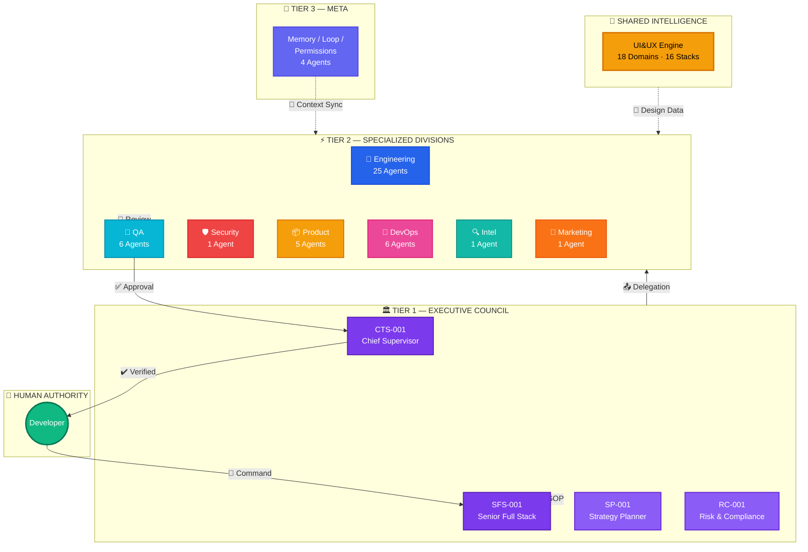
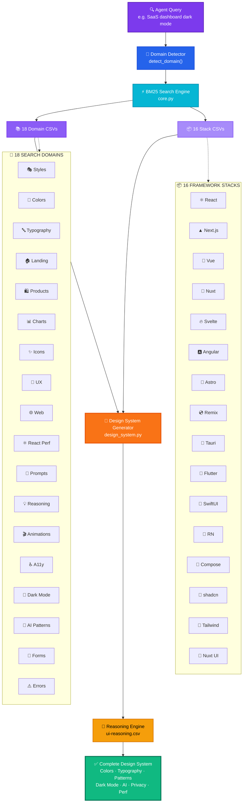
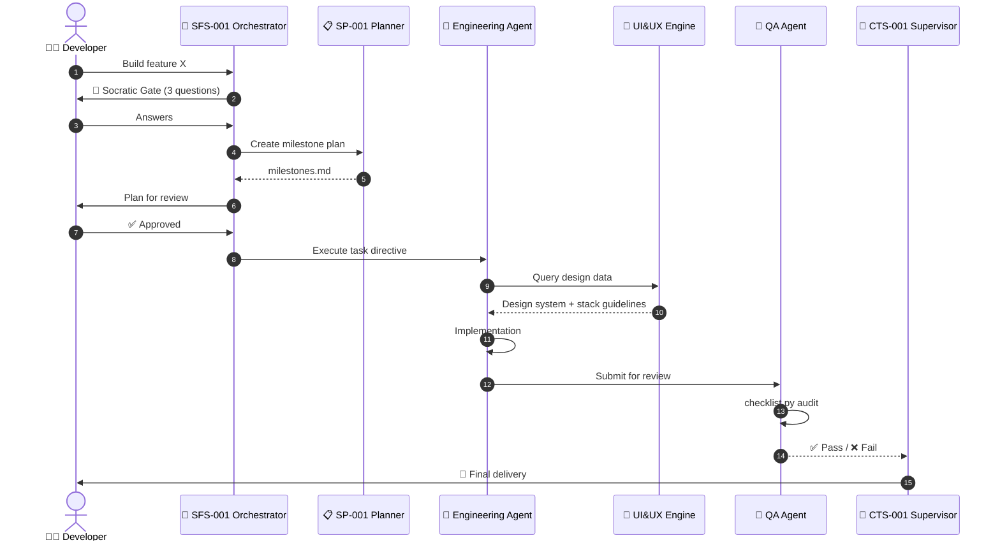
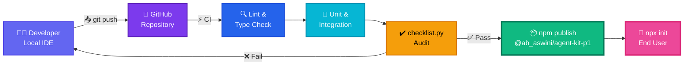

<div align="center">

# 🚀 Agent-Kit

### ✨ The AI Software Company That Lives in Your IDE ✨

**One developer. 53 autonomous agents. The output of a 30-person engineering team.**

<br/>

[](https://www.npmjs.com/package/@ab_aswini/agent-kit-p1)
[](https://github.com/Ab-aswini/Agent-kit-P1)
[](https://www.npmjs.com/package/@ab_aswini/agent-kit-p1)
[](LICENSE)
[](https://github.com/Ab-aswini/Agent-kit-P1)
[](https://github.com/Ab-aswini/Agent-kit-P1)
[](https://github.com/Ab-aswini/Agent-kit-P1)

<br/>

<a href="https://www.npmjs.com/package/@ab_aswini/agent-kit-p1"></a>

<br/><br/>

**[🏗️ Architecture](#-high-level-architecture)** · **[🎨 UI&UX Engine](#-uiux-intelligence-engine)** · **[⚡ Quick Start](#-getting-started)** · **[🗺️ Roadmap](#-future-roadmap)**

</div>

<br/>

---

## 📋 Table of Contents

- [🎯 Vision & Problem Statement](#-vision--problem-statement)
- [🔭 System Overview](#-system-overview)
- [🏗️ High-Level Architecture](#-high-level-architecture)
- [🧱 Detailed Architecture Breakdown](#-detailed-architecture-breakdown)
- [👥 Core Agents & Departments](#-core-agents--departments)
- [🎨 UI&UX Intelligence Engine](#-uiux-intelligence-engine)
- [🔄 Data Flow](#-data-flow)
- [📡 Request Lifecycle](#-request-lifecycle)
- [⚙️ Tech Stack](#️-tech-stack)
- [🛡️ Security & Privacy Design](#️-security--privacy-design)
- [📐 Scalability Strategy](#-scalability-strategy)
- [🚢 Deployment Architecture](#-deployment-architecture)
- [⚡ Getting Started](#-getting-started)
- [🗺️ Future Roadmap](#️-future-roadmap)
- [🤝 Contribution Guide](#-contribution-guide)
- [📄 License](#-license)

---

## 🎯 Vision & Problem Statement

Modern software demands the coordinated output of dozens of specialists — architects, frontend engineers, backend developers, QA analysts, security auditors, UX designers, and DevOps operators. Solo developers and small teams cannot sustain this breadth without burning out or shipping gaps.

**Agent-Kit eliminates this constraint.** It deploys a fleet of **53 purpose-built AI agents** — organized into **9 departments** with **tiered governance** — directly into your IDE. Every agent follows the **Iron Well v2.0** protocol: strict 2-phase orchestration, Socratic Gate planning, and hierarchical approval chains.

> [!TIP]
> **Built for 2026:** AI-native orchestration, automation-first workflows, privacy-aware data pipelines (GDPR/CCPA columns baked into every dataset), and agent-readiness scoring on every design decision.

---

## 🔭 System Overview

Agent-Kit is a **local-first, multi-agent orchestration framework** distributed as an NPM package. It scaffolds a complete `.agent-os` directory into any project, providing:

| Component | Count | Description |
|:---------:|:-----:|:------------|
| 🤖 **Agents** | 53 | Engineering, QA, Security, Product, DevOps, Marketing, Intelligence, Meta |
| 🧠 **Skills** | 42+ | Clean code, security, TDD, architecture, debugging, deployment |
| ⚙️ **Workflows** | 19 | Create, debug, deploy, test, orchestrate, plan, enhance |
| 🎨 **UI&UX Engine** | 34 CSVs | 18 design domains + 16 framework stacks + BM25 search + design system gen |
| 🛡️ **Governance** | Iron Well v2.0 | Socratic Gate + 2-phase execution + hierarchical authority |

---

## 🏗️ High-Level Architecture

Agent-Kit operates on a **Tiered Governance Model** where authority flows from the Human Owner through Executive, Departmental, and Meta-Management layers.



---

## 🧱 Detailed Architecture Breakdown

The system is composed of **four distinct layers**. Each layer is independently scalable and communicates through well-defined interfaces.

```mermaid
%%{init: {'theme': 'default'}}%%

graph TD
  subgraph L4["🖥️ LAYER 4 — INTERFACE"]
    CLI["⌨️ CLI<br/>init · doctor · interactive"]
    IDE["💻 IDE Integration<br/>Cursor · VS Code · Windsurf"]
    NPX["📦 NPX Distribution<br/>npm publish"]
  end

  subgraph L3["🎛️ LAYER 3 — ORCHESTRATION"]
    GATE["🚦 Socratic Gate<br/>3-Question Filter"]
    PHASE["⚡ 2-Phase Engine<br/>Plan then Execute"]
    GOV["👑 Tiered Governance<br/>Owner to Exec to Dept"]
    WF["📋 Workflow Engine<br/>19 Pre-built SOPs"]
  end

  subgraph L2["🧠 LAYER 2 — INTELLIGENCE"]
    BM25["🔍 BM25 Search<br/>core.py"]
    DSG["🎨 Design System Gen<br/>design_system.py"]
    REASON["💡 Reasoning Engine<br/>ui-reasoning.csv"]
    SPAWN["🤖 Agent Spawner<br/>spawn_agent.py"]
  end

  subgraph L1["💾 LAYER 1 — DATA"]
    AGENTS["📄 53 Agent Defs<br/>.md protocols"]
    SKILLS["🧩 42+ Skills<br/>SKILL.md format"]
    CSV["📊 34 CSVs<br/>18 domains + 16 stacks"]
    MEM["🧠 Memory Hubs<br/>global + backend + frontend"]
  end

  L4 --> L3
  L3 --> L2
  L2 --> L1

  style CLI fill:#7C3AED,stroke:#5B21B6,stroke-width:2px,color:#fff
  style IDE fill:#8B5CF6,stroke:#6D28D9,stroke-width:2px,color:#fff
  style NPX fill:#A78BFA,stroke:#7C3AED,stroke-width:2px,color:#fff
  style GATE fill:#EF4444,stroke:#DC2626,stroke-width:2px,color:#fff
  style PHASE fill:#EC4899,stroke:#DB2777,stroke-width:2px,color:#fff
  style GOV fill:#F43F5E,stroke:#E11D48,stroke-width:2px,color:#fff
  style WF fill:#FB7185,stroke:#F43F5E,stroke-width:2px,color:#fff
  style BM25 fill:#F59E0B,stroke:#D97706,stroke-width:2px,color:#000
  style DSG fill:#F97316,stroke:#EA580C,stroke-width:2px,color:#fff
  style REASON fill:#FBBF24,stroke:#F59E0B,stroke-width:2px,color:#000
  style SPAWN fill:#FCD34D,stroke:#FBBF24,stroke-width:2px,color:#000
  style AGENTS fill:#10B981,stroke:#047857,stroke-width:2px,color:#fff
  style SKILLS fill:#06B6D4,stroke:#0891B2,stroke-width:2px,color:#fff
  style CSV fill:#14B8A6,stroke:#0D9488,stroke-width:2px,color:#fff
  style MEM fill:#2DD4BF,stroke:#14B8A6,stroke-width:2px,color:#000
```



---

## 👥 Core Agents & Departments

| # | Department | Lead | 🤖 | Focus Area |
|:-:|:-----------|:-----|:--:|:-----------|
| 1 | 🏛️ **Executive Council** | CTS-001, SFS-001 | 4 | Strategic planning, supervision, risk |
| 2 | 🔧 **Engineering — Backend** | BE-001 | 10 | API, database, auth, services |
| 3 | 🎨 **Engineering — Frontend** | FE-001 | 8 | Components, state, routing, styling |
| 4 | 🗄️ **Engineering — Database** | DB-001 | 5 | Schema, migrations, optimization |
| 5 | 📱 **Engineering — Mobile** | MOB-001 | 1 | React Native, Flutter, native |
| 6 | 🎮 **Engineering — Game** | GAME-001 | 1 | Mechanics, physics, engines |
| 7 | 🧪 **QA & Verification** | QA-001 | 6 | Testing, coverage, audit |
| 8 | 🛡️ **Security** | SEC-001 | 1 | Threat modeling, pen testing |
| 9 | 📦 **Product & Docs** | PM-001 | 5 | PRDs, UX research, README |
| 10 | 🚀 **DevOps** | DO-001 | 6 | CI/CD, Docker, monitoring |
| 11 | 🔍 **Intelligence** | INTEL-001 | 1 | Legacy archaeology, research |
| 12 | 📢 **Marketing** | MKT-001 | 1 | SEO/GEO, brand authority |
| 13 | 🧠 **Meta-Management** | MM-001 | 4 | Memory, loops, permissions |
| | | **Total** | **53** | |

---

## 🎨 UI&UX Intelligence Engine

The **UI&UX Engine** is a Python-based intelligence layer that gives every agent instant access to structured design knowledge. It powers automated design system generation, framework-specific guidance, and domain-aware search.



### Engine Capabilities

| Capability | Details |
|:-----------|:--------|
| 🌈 **Search Domains** | 18 specialized CSVs — styles, colors, typography, landing, products, charts, icons, UX, web, React perf, prompts, reasoning, animations, accessibility, dark mode, AI patterns, forms, error states |
| 📦 **Framework Stacks** | 16 framework CSVs with `Dark_Mode_Strategy`, `AI_Integration_Level`, `Privacy_Tier`, `Agent_Readiness`, `Performance_Budget` |
| ⚡ **Search Algorithm** | BM25 ranking with tokenization, IDF weighting, configurable k1/b |
| 🧭 **Auto-Detection** | `detect_domain()` maps natural language → optimal domain via keyword scoring |
| 🎨 **Design System Gen** | Multi-domain aggregation + reasoning → complete design system |
| 📄 **Output Formats** | ASCII box (CLI), Markdown, persistent `MASTER.md` + page overrides |

---

## 🔄 Data Flow

```mermaid
%%{init: {'theme': 'default'}}%%

flowchart LR
  REQ((🧑‍💻 User<br/>Requirement)) -->|"📨 Input"| GATE["🚦 Socratic Gate<br/>3 Strategic Questions"]
  GATE -->|"✅ Aligned"| PLAN["📋 Phase 1<br/>PLANNING"]
  PLAN -->|"👑 CTS Approval"| EXEC["⚡ Phase 2<br/>EXECUTION"]
  EXEC -->|"🧪 Code + Tests"| VER["✔️ VERIFICATION<br/>checklist.py"]
  VER -->|"✅ Pass"| DOC["📝 RA-001<br/>Documentation"]
  DOC --> SHIP((🚀 PR-Ready<br/>Output))

  VER -->|"❌ Fail"| EXEC

  style REQ fill:#7C3AED,color:#fff,stroke:#5B21B6,stroke-width:3px
  style GATE fill:#EF4444,color:#fff,stroke:#DC2626,stroke-width:2px
  style PLAN fill:#2563EB,color:#fff,stroke:#1D4ED8,stroke-width:2px
  style EXEC fill:#EC4899,color:#fff,stroke:#DB2777,stroke-width:2px
  style VER fill:#F59E0B,color:#000,stroke:#D97706,stroke-width:2px
  style DOC fill:#06B6D4,color:#fff,stroke:#0891B2,stroke-width:2px
  style SHIP fill:#10B981,color:#fff,stroke:#047857,stroke-width:3px
```



> [!IMPORTANT]
> **Zero-drift guarantee:** No code is written until the Socratic Gate confirms 100% alignment. No code ships until `checklist.py` passes verification.

---

## 📡 Request Lifecycle



---

## ⚙️ Tech Stack

| Layer | Technology | Purpose |
|:-----:|:-----------|:--------|
| 📦 | **NPM / NPX** | One-command installation and updates |
| ⌨️ | **Node.js, fs-extra, picocolors** | CLI: init, doctor, interactive archetype |
| 🏗️ | **Markdown protocols, JSON manifests** | Agent definitions, governance rules |
| 🔍 | **Python, BM25 (custom)** | Full-text search over 34 CSV datasets |
| 🎨 | **Python, CSV, JSON** | Automated design system generation |
| 🔐 | **FastAPI, Bcrypt, JWT** | Production-ready authentication demo |
| ✔️ | **checklist.py** | 360° framework health validation |
| 📊 | **Mermaid.js** | Architecture and flow diagrams |
| 🧠 | **Structured Markdown** | Persistent memory across sessions |

---

## 🛡️ Security & Privacy Design

Agent-Kit enforces security at every layer:

| Mechanism | Implementation |
|:----------|:---------------|
| 🚦 **Socratic Gate** | 3-question strategic filter before complex tasks — prevents goal drift |
| 👑 **Tiered Authority** | RBAC-inspired: Owner → Executive → Department → Meta |
| 🛡️ **Iron Well v2.0** | Strict Plan → Execute with mandatory CTS-001 approval gates |
| 🔒 **Privacy Columns** | `Privacy_Tier` (GDPR/CCPA/HIPAA), consent-before-track, data minimization |
| 🔍 **Security Agent** | SEC-001: threat modeling, pen testing, shift-left audit |
| 🐒 **Chaos Testing** | `security_chaos_test.py` simulates active threats |
| 📡 **API Contracts** | `sync_api_contracts.py` enforces backend-frontend alignment |

---

## 📐 Scalability Strategy

Agent-Kit scales from a **14-agent portfolio** to the **full 53-agent fleet**:

```mermaid
%%{init: {'theme': 'default'}}%%

flowchart LR
  subgraph SELECT["🏗️ Choose Your Archetype"]
    direction TB
    A1["🚀 SaaS Startup<br/>44 agents"]
    A2["📱 Mobile App<br/>26 agents"]
    A3["🛒 E-commerce<br/>45 agents"]
    A4["🖼️ Portfolio<br/>14 agents"]
    A5["📊 Dashboard<br/>29 agents"]
    A6["📝 Blog/CMS<br/>21 agents"]
    A7["🎓 EdTech<br/>32 agents"]
    A8["🏥 Healthcare<br/>40 agents"]
    A9["🏪 Marketplace<br/>47 agents"]
    A10["🤖 AI/ChatBot<br/>30 agents"]
    A11["🎮 Gaming<br/>23 agents"]
    A12["⚙️ API-First<br/>33 agents"]
    A13["💎 Full Fleet<br/>53 agents"]
  end

  SELECT --> CLI["⌨️ CLI<br/>init --interactive"]
  CLI --> DEPLOY["✅ Selective<br/>Deployment"]

  style A1 fill:#7C3AED,color:#fff,stroke:#5B21B6
  style A2 fill:#2563EB,color:#fff,stroke:#1D4ED8
  style A3 fill:#EC4899,color:#fff,stroke:#DB2777
  style A4 fill:#10B981,color:#fff,stroke:#047857
  style A5 fill:#F59E0B,color:#000,stroke:#D97706
  style A6 fill:#06B6D4,color:#fff,stroke:#0891B2
  style A7 fill:#8B5CF6,color:#fff,stroke:#7C3AED
  style A8 fill:#EF4444,color:#fff,stroke:#DC2626
  style A9 fill:#F97316,color:#fff,stroke:#EA580C
  style A10 fill:#14B8A6,color:#fff,stroke:#0D9488
  style A11 fill:#6366F1,color:#fff,stroke:#4F46E5
  style A12 fill:#84CC16,color:#000,stroke:#65A30D
  style A13 fill:#FBBF24,color:#000,stroke:#F59E0B
  style CLI fill:#7C3AED,color:#fff,stroke:#5B21B6,stroke-width:3px
  style DEPLOY fill:#10B981,color:#fff,stroke:#047857,stroke-width:3px
```



> [!NOTE]
> **Selective loading:** The CLI copies only the agents, skills, and departments relevant to your chosen archetype — **zero bloat**.

---

## 🚢 Deployment Architecture



---

## ⚡ Getting Started

<div align="center">

### ⚡ Quick Install (Recommended)

```bash
npx @ab_aswini/agent-kit-p1 init
```

> Scaffolds the complete `.agent-os` directory **(53 agents, 42+ skills, 19 workflows, UI&UX engine)** into your current project.

</div>

---

### 🎯 Interactive Mode — Pick Your Archetype

```bash
npx @ab_aswini/agent-kit-p1 init --interactive
```

Select from **13 company archetypes** (SaaS, Mobile, E-commerce, Portfolio, etc.) and deploy only the agents you need.

---

### 🌐 Global Installation

```bash
npm install -g @ab_aswini/agent-kit-p1
```

Then use anywhere:

```bash
cd your-project
agent-kit init
```

---

### 🩺 Health Check

```bash
npx @ab_aswini/agent-kit-p1 doctor
```

Validates all core structures, agents, skills, and configurations.

---

### 📖 CLI Reference

| Command | Shorthand | Description |
|:--------|:----------|:------------|
| `npx @ab_aswini/agent-kit-p1 init` | `agent-kit init` | Scaffold all 53 agents |
| `npx @ab_aswini/agent-kit-p1 init -i` | `agent-kit init -i` | Interactive archetype selection |
| `npx @ab_aswini/agent-kit-p1 doctor` | `agent-kit doctor` | System health validation |

---

### 🎬 Post-Installation

| Step | Action |
|:----:|:-------|
| 1 | **Open in AI IDE** — VS Code, Cursor, or Windsurf |
| 2 | **Activate** — Tell your AI: *"Read `.agent-os/agents/tier-1/chief-technical-supervisor.agent.md`"* |
| 3 | **Verify** — `python scripts/checklist.py` for full health validation |
| 4 | **Spawn** — `python scripts/spawn_agent.py BE-001` for a ready-to-paste system prompt |

> [!TIP]
> After installation, run `agent-kit doctor` to confirm everything was scaffolded correctly.

---

## 🗺️ Future Roadmap

| Initiative | Status | Description |
|:-----------|:------:|:------------|
| 🏪 Agent Marketplace | 🔜 | Community-contributed agent templates and skills |
| 🔀 Multi-LLM Router | 🔜 | Per-agent model selection (GPT / Claude / Gemini) |
| 📊 Live Dashboard | 🔜 | Web-based fleet status monitoring |
| 🔌 MCP Integration | 🔜 | Native Model Context Protocol server |
| 🎙️ Voice-First Agents | 🧪 | Voice-driven agent interaction |
| 🤝 Agent-to-Agent Protocol | 🧪 | Direct inter-agent communication |

---

## 🤝 Contribution Guide

We welcome contributions. Agent-Kit is modular — every agent, skill, and dataset is an independent unit.

### 🤖 Adding a New Agent

1. Create `your-agent.agent.md` in `.agent-os/agents/<department>/`
2. Follow the template: Identity → Protocol → Boundaries → Anti-Patterns
3. Register in `manifest.json`
4. Submit PR

### 🧩 Adding a New Skill

1. Create `.agent-os/skills/your-skill/SKILL.md` with YAML frontmatter
2. Include helper scripts in `scripts/` and examples in `examples/`

### 📊 Adding a New CSV Dataset

1. Add CSV to `.agent-os/.shared/ui-ux-pro-max/data/` or `data/stacks/`
2. Register in `core.py` → `CSV_CONFIG` or `STACK_CONFIG`
3. Add keywords to `detect_domain()` for auto-routing
4. Validate with test suite

### 🔄 Workflow

```
Fork → Branch → Implement → Test → PR → Review → Merge
```

---

## 📄 License

This project is licensed under the **MIT License** — see [LICENSE](LICENSE) for details.

---

<div align="center">
<br/>

**✨ Built for solo developers who think like companies ✨**

<sub>🤖 53 agents · 🎨 18 design domains · 📦 16 framework stacks · 🛡️ Iron Well v2.0</sub>

<br/>

[](https://www.npmjs.com/package/@ab_aswini/agent-kit-p1)
[](https://github.com/Ab-aswini/Agent-kit-P1)
[](https://github.com/Ab-aswini/Agent-kit-P1/issues)

<br/>

**⭐ Star this repo if Agent-Kit helps your workflow!**

</div>
