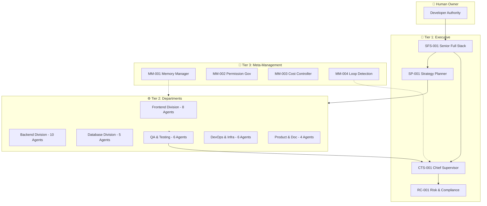
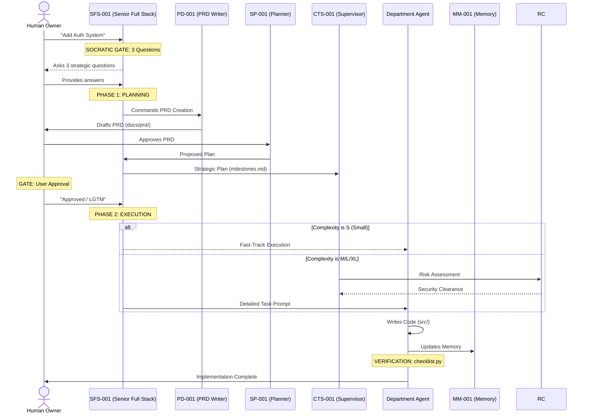

## 🔍 Project Analysis Complete

**Project Type:** Multi-Agent Orchestration Framework (AI-OS)  
**Tech Stack:** Markdown (Rules), JSON (Protocol), FastAPI/SQLAlchemy (Demo)  
**Architecture Pattern:** Hierarchical Governance (Tiered Agents)  
**Diagrams to generate:** Agent Hierarchy, Workflow Logic, Directory Map, Feature Mindmap, Demo Schema, Deployment Flow

---

# 🏢 Agent-Kit — AI Software Company in Your IDE

<div align="center">
  <p><strong>Turn your AI-powered IDE into a 43-agent software company.</strong></p>
  <p>One solo developer. The output of a 15–30 person team.</p>

  
  
  
</div>

---

## 📌 Table of Contents
- [Overview](#overview)
- [Architecture](#architecture)
- [Tech Stack](#tech-stack)
- [Project Structure](#project-structure)
- [Data Flow](#data-flow)
- [Features](#features)
- [Getting Started](#getting-started)
- [Documentation & Skills](#documentation--skills)
- [Database Schema (Demo)](#database-schema-demo)
- [Deployment](#deployment)
- [Contributing](#contributing)

---

## 🧭 Overview
Recently enhanced with **Iron Well Patterns**, the system now features the **Socratic Gate**, **2-Phase Orchestration**, and **Industrial-Pro Aesthetics**. These upgrades ensure 100% clarity before implementation and a strict boundary between planning and execution.

---

## 🛡️ Core Engine Rules (P0)

| Rule | Protocol |
| :--- | :--- |
| **The Socratic Gate** | Complexity > S requires 3 strategic clarifying questions. |
| **2-Phase Orchestration** | Strict separation: Planning (docs/PLAN.md) → User Approval → Implementation. |
| **Standardized Skills** | Dynamic loading from `.agent-os/skills/[NAME]/SKILL.md`. |
| **Hierarchical Governance** | CTS-001 (Executive) must approve all cross-departmental changes. |
| **Mandatory Verification** | Every task completion requires a `python scripts/checklist.py` run. |

---

## 🏥 Framework Health & Stability

The Agent-Kit has undergone a **360° Comprehensive Audit** to ensure industrial-pro reliability.

- **Path Integrity**: ✅ 100% Harmonized (No legacy `.agent/` references).
- **Agent Compliance**: ✅ 52 agents verified with unique IDs and standard context.
- **Skill Architecture**: ✅ Migrated to directory-based `SKILL.md` (Version 2.0).
- **Memory Integrity**: ✅ Global Hub (`architecture`, `conventions`, `decisions`) fully synced.

> [!IMPORTANT]
> To verify health at any time, run: `python scripts/checklist.py`

---

## 🏗️ Architecture

Agent-Kit operates on a **Tiered Governance Model**, where authority flows from the Human Owner down through Executive, Departmental, and Meta-Management layers.



### 🗂️ Detailed Directory Map

```text
.agent-os/
├── config/                 # System configuration (permissions, settings)
├── agents/                 # Agent definitions (43 unique roles)
│   ├── tier-1/             # Executive Council (CTS, SP, RC)
│   ├── engineering/        # Production Specialists (FE, BE, Mobile, Game)
│   ├── qa/                 # Validation Experts (Review, Test, Perf, Sec)
│   └── meta/               # Framework Stability (Memory, loop, Permission)
├── memory/                 # Persistent Framework Knowledge
│   ├── global/             # Core architecture and conventions
│   └── [departments]/      # Domain-specific persistent context
├── skills/                 # High-Authority knowledge modules
├── workflows/              # Standard Operating Procedures (SOPs)
└── templates/              # Standardized AI output formats
```

---

## 🔄 Data Flow (The Development Lifecycle)

How a requirement becomes code via the **Phase-Optimized Workflow**.



### ⚡ Quick Workflow Guide
1. **Plan a New Feature**: Load `.agent-os/workflows/plan.workflow.md`
2. **Execute Implementation**: Load `.agent-os/workflows/create.workflow.md`
3. **Debug Issues**: Load `.agent-os/workflows/debug.workflow.md`
4. **Deploy to Production**: Load `.agent-os/workflows/deploy.workflow.md`

---

## 🛠️ Phase 1 Active Agent Roster

These agents are currently active and ready for orchestration:

| ID | Agent | Department | Specialty |
|----|-------|------------|-----------|
| **CTS-001** | Chief Technical Supervisor | Executive | Governance & Approval |
| **SP-001** | Strategy Planner | Executive | Milestones & Roadmaps |
| **RC-001** | Risk & Compliance | Executive | Security & Standards |
| **FE-001** | UI Architect | Frontend | Industrial-Pro Design |
| **BE-001** | API Architect | Backend | Schema & Route Logic |
| **MM-001** | Memory Manager | Meta | Context Maintenance |

---

## ⚡ Features

```mermaid
<<<<<<< HEAD
mindmap
  root((Agent-Kit))
    Governance
      43 Specialized Roles
      Tiered Approval Gates
      Permission Boundaries
    Workflows
      Fast-Track (Low Complexity)
      Standard (Full Audit)
      Emergency Rollback
    Memory System
      Layered Context
      Pruning (Anti-Bloat)
      Auto-Sync
    DX Tools
      Tooling Hints
      Standardized JSON Protocol
      Hybrid Markdown Feedback
=======
flowchart LR
    Root((Agent-Kit))
    
    Governance[🛡️ Governance]
    Workflows[🔄 Workflows]
    Memory[🧠 Memory System]
    DX[🛠️ DX Tools]
    
    Roles[43 Specialized Roles]
    Gates[Tiered Approval Gates]
    Boundaries[Permission Boundaries]
    
    Fast[Fast-Track S-Tasks]
    Audit[Standard Full Audit]
    Roll[Emergency Rollback]
    
    Layer[Layered Context]
    Prune[Pruning & Anti-Bloat]
    Sync[Auto-Sync Engine]
    
    Hints[Tooling Hints]
    JSON[Standardized Protocol]
    Hybrid[Hybrid Feedback]

    %% Connections
    Root --- Governance
    Root --- Workflows
    Root --- Memory
    Root --- DX
    
    Governance --- Roles
    Governance --- Gates
    Governance --- Boundaries
    
    Workflows --- Fast
    Workflows --- Audit
    Workflows --- Roll
    
    Memory --- Layer
    Memory --- Prune
    Memory --- Sync
    
    DX --- Hints
    DX --- JSON
    DX --- Hybrid

    %% Styling
    classDef main fill:#2c3e50,stroke:#3498db,stroke-width:4px,color:#fff,font-weight:bold
    classDef category fill:#34495e,stroke:#3498db,stroke-width:2px,color:#fff
    classDef feature fill:#1a2b3c,stroke:#2980b9,stroke-width:1px,color:#eee

    class Root main
    class Governance,Workflows,Memory,DX category
    class Roles,Gates,Boundaries,Fast,Audit,Roll,Layer,Prune,Sync,Hints,JSON,Hybrid feature
>>>>>>> b538c39 (Finalized Agent-Kit with SFS-001, optimized workflows, stylized high-fidelity diagrams, and resolved conflicts)
```

---

## 🚀 Getting Started

### 📦 Quick Start (NPX)
You can initialize Agent-Kit in any new project directory without cloning the full repository:

```bash
mkdir my-new-project
cd my-new-project
npx agent-kit-p1 init
```

---

### 🛠️ Manual Installation

1. **Initialization**: Run `python .agent-os/scripts/hub-setup.py` to prepare the environment.
2. **Strategy**: Tell your AI: *"Read .agent-os/agents/tier-1/strategy-planner.agent.md and help me plan my new feature."*
3. **Execution**: Follow the **Fast-Track** workflow for minor fixes by tagging your request with `[Complexity: S]`.
4. **Health Check**: Run `python scripts/checklist.py` to verify system integrity.

---

## 📄 License
This project is licensed under the **MIT License**.

---

<div align="center">
  <strong>Built for solo developers who think like companies.</strong>
</div>
<<<<<<< HEAD
<<<<<<< HEAD
=======
>>>>>>> e8d2acb (Finalized Agent-Kit with SFS-001, Fast-Track workflows, and high-fidelity documentation)
>>>>>>> b538c39 (Finalized Agent-Kit with SFS-001, optimized workflows, stylized high-fidelity diagrams, and resolved conflicts)
=======
>>>>>>> c255649 (feat: Finalize Ultimate Hub - Consolidated .agent-os, Standardized Skills, and Integrated 360 Health Check)
