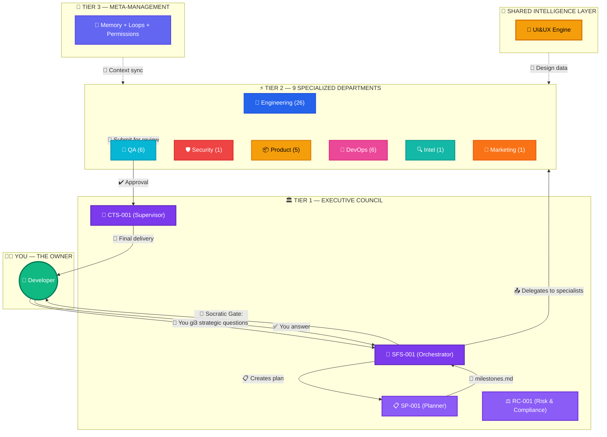
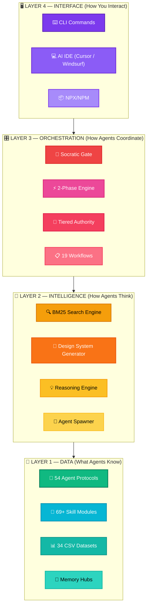
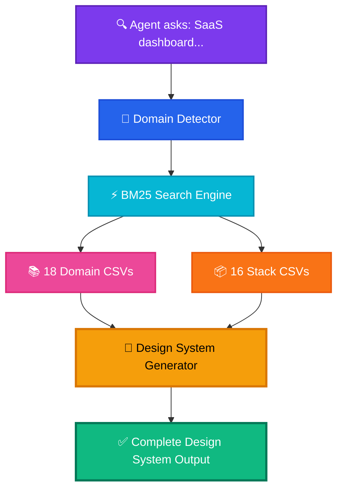
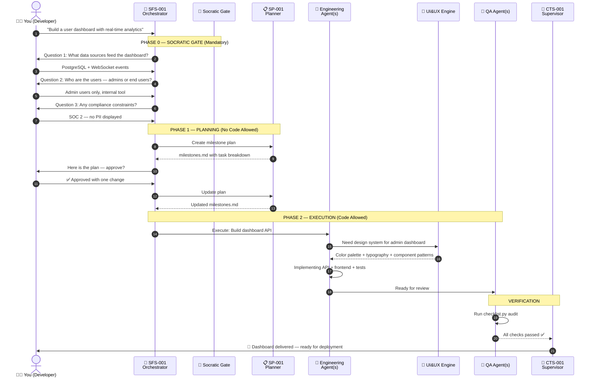

<p align="center">
  
</p>

<h1 align="center">
  <br>
  <code>54 AI Agents. 1 Command. Zero API Keys.</code>
  <br>
</h1>

<p align="center">
  <strong>Turn any project directory into an AI-powered software company.</strong><br>
  <sub>The ultimate MCP server for Google Antigravity, Cursor, Claude Code, VS Code Copilot & Windsurf</sub>
</p>

<p align="center">
  <a href="https://www.npmjs.com/package/@ab_aswini/agent-kit-p1"></a>
  <a href="https://www.npmjs.com/package/@ab_aswini/agent-kit-p1"></a>
  <a href="https://github.com/Ab-aswini/Agent-kit-P1"></a>
  <a href="LICENSE"></a>
  <a href="https://github.com/Ab-aswini/Agent-kit-P1"></a>
  <a href="https://github.com/Ab-aswini/Agent-kit-P1"></a>
  <a href="https://github.com/Ab-aswini/Agent-kit-P1"></a>
</p>

<br>

<div align="center">

```
  ╔══════════════════════════════════════════════════════════════════╗
  ║                                                                  ║
  ║   ⚡  npx @ab_aswini/agent-kit-p1 init                          ║
  ║                                                                  ║
  ║   Done. Your 54-agent AI company is live.                        ║
  ║                                                                  ║
  ║   🏭 54 Agents  ·  🧩 69+ Skills  ·  📋 19 Workflows            ║
  ║   🎨 600K+ Design Data Points  ·  🛡️ Iron Well Governance        ║
  ║                                                                  ║
  ╚══════════════════════════════════════════════════════════════════╝
```

</div>

<!-- SEO METADATA FOR GITHUB ARCHITECTURE SEARCH -->
<!-- keywords: google antigravity, model context protocol, mcp server, cursor agent, claude desktop, windsurf, copilot, autonomous agents, multi-agent framework, semantic memory, tree-of-thought, ai ide augmentation, developer tools, local-first ai, claude code, vscode codex -->

---

<details>
<summary><h2>📋 Table of Contents</h2></summary>

|  #  | Section | What You'll Learn |
|:---:|:--------|:------------------|
| 1 | [The Pitch](#-the-pitch--why-agent-kit) | Why this exists — the 30-second story |
| 2 | [Quick Start](#-quick-start) | From zero to 54 agents in 60 seconds |
| 3 | [How It Works](#%EF%B8%8F-how-it-works--architecture) | The governance model, layers, and control flow |
| 4 | [Meet Your Team](#-meet-your-team--54-agents) | Every department, every agent, every role |
| 5 | [UI&UX Intelligence Engine](#-uiux-intelligence-engine) | The built-in design brain with 18 domains & 16 stacks |
| 6 | [The Iron Well Protocol](#-the-iron-well-protocol) | How governance actually works step-by-step |
| 7 | [Install & Setup (All Methods)](#-install--setup-all-methods) | Every way to install + MCP config |
| 8 | [Company Archetypes](#-company-archetypes) | Choose your team size from 14 to 54 agents |
| 9 | [Tech Stack](#%EF%B8%8F-tech-stack) | What's under the hood |
| 10 | [Security & Privacy](#%EF%B8%8F-security--privacy) | How safety is enforced at every layer |
| 11 | [Deployment Pipeline](#-deployment-pipeline) | From your IDE to NPM to the end user |
| 12 | [Roadmap](#%EF%B8%8F-roadmap) | What's coming next |
| 13 | [Contributing](#-contributing) | How to add agents, skills, or datasets |
| 14 | [License](#-license) | MIT — fully open |

</details>

---

## 🎯 The Pitch — Why Agent-Kit?

<table>
<tr>
<td width="50%">

### 😰 Without Agent-Kit
```
You: "Build me a dashboard"
AI:  *immediately starts coding*
     *wrong architecture*
     *no tests*
     *security holes*
     *3 rewrites later...*
```

</td>
<td width="50%">

### 🏭 With Agent-Kit
```
You: "Build me a dashboard"
AI:  → Socratic Gate: 3 strategic questions
     → Strategy Planner creates milestones
     → Backend + Frontend + DB agents execute
     → QA validates, Security audits
     → CTO approves final delivery ✅
```

</td>
</tr>
</table>

**Agent-Kit gives your IDE's AI something it never had: a company structure.**

> You become the **CTO**. Your AI becomes **54 specialized employees** — each with defined roles, boundaries, skills, and a chain of command. No more single-brain AI chaos.

### The Key Insight

Your IDE already has a powerful AI brain (Copilot, Gemini, Claude). What it **doesn't** have is:

| Missing Piece | Agent-Kit Provides |
|:---|:---|
| 🏛️ Governance | Iron Well Protocol — military-grade chain of command |
| 🧠 Memory | Persistent architecture, decisions, and conventions across sessions |
| 👥 Specialization | 54 agents with distinct expertise, not one generalist |
| 🚦 Quality Gates | Mandatory planning before coding, mandatory review after |
| 🎨 Design Intelligence | 600K+ data points across 18 design domains |
| 🔐 Security | Built-in threat modeling, chaos testing, OWASP scanning |

> [!IMPORTANT]
> **Zero API Keys Required.** Agent-Kit is NOT another LLM wrapper. It's a **Supportive Office** for your IDE's native AI. You provide the brain (Copilot, Gemini, Claude); Agent-Kit provides the company (structure, rules, memory, tools).

---

## 🚀 Quick Start

### 60-Second Setup

```bash
# Step 1: Deploy your AI company (one command)
npx @ab_aswini/agent-kit-p1 init

# Step 2: Verify everything works
npx @ab_aswini/agent-kit-p1 doctor

# Step 3: Open in your AI IDE and start building
# Tell your AI: "Read the CTS-001 agent and audit this project"
```

### What Just Happened?

```
your-project/
├── .agentkit              ← Tiny pointer file (only thing in your project)
└── ~/.agent-kit-store/    ← Global store (zero-footprint)
    ├── 54 Agent protocols
    ├── 69+ Skill modules
    ├── 19 Workflow SOPs
    ├── 34 CSV datasets (600K+ data points)
    ├── Memory system
    └── MCP server ready
```

### Connect to Your IDE

<details>
<summary><b>🟣 Google Antigravity / Cursor</b></summary>

Add to MCP Settings:
- **Name:** `Agent-Kit`
- **Type:** `command`
- **Command:** `npx @ab_aswini/agent-kit-p1 mcp`
</details>

<details>
<summary><b>🔵 Claude Desktop / Claude Code</b></summary>

Add to `claude_desktop_config.json`:
```json
{
  "mcpServers": {
    "agent-kit": {
      "command": "npx",
      "args": ["@ab_aswini/agent-kit-p1", "mcp"]
    }
  }
}
```
</details>

<details>
<summary><b>🟢 VS Code + Copilot / Codex</b></summary>

Load the agent definitions from `.agent-os/agents/` into your workspace context. The MCP server works with any MCP-compatible extension.
</details>

**6 MCP Tools exposed to your AI:**
`list_agents` · `get_agent_prompt` · `query_ui_ux_engine` · `run_memory_sync` · `run_checklist` · `run_security_chaos`

---

## 🏗️ How It Works — Architecture

### The Company Org Chart


```mermaid
%%{init: {'theme': 'default'}}%%

graph TD
  subgraph HUMAN["🧑‍💻 YOU — THE OWNER"]
    H(("👤 Developer"))
  end

  subgraph EXECUTIVE["🏛️ TIER 1 — EXECUTIVE COUNCIL"]
    SFS["🎯 SFS-001 (Orchestrator)"]
    CTS["👑 CTS-001 (Supervisor)"]
    SP["📋 SP-001 (Planner)"]
    RC["⚖️ RC-001 (Risk & Compliance)"]
  end

  subgraph DEPARTMENTS["⚡ TIER 2 — 9 SPECIALIZED DEPARTMENTS"]
    direction LR
    ENG["🔧 Engineering (26)"]
    QA["🧪 QA (6)"]
    SEC["🛡️ Security (1)"]
    PROD["📦 Product (5)"]
    DX["🚀 DevOps (6)"]
    INTEL["🔍 Intel (1)"]
    MKT["📢 Marketing (1)"]
  end

  subgraph META["🧠 TIER 3 — META-MANAGEMENT"]
    MM["🧠 Memory + Loops + Permissions"]
  end

  subgraph INTELLIGENCE["🎨 SHARED INTELLIGENCE LAYER"]
    UX["🎨 UI&UX Engine"]
  end

  H -->|"📝 You give a task"| SFS
  SFS -->|"🚦 Socratic Gate:<br/>3 strategic questions"| H
  H -->|"✅ You answer"| SFS
  SFS -->|"📋 Creates plan"| SP
  SP -->|"📄 milestones.md"| SFS
  SFS -->|"📤 Delegates to specialists"| DEPARTMENTS
  DEPARTMENTS -->|"🧪 Submit for review"| QA
  QA -->|"✔️ Approval"| CTS
  CTS -->|"🚀 Final delivery"| H

  META -.->|"🔗 Context sync"| DEPARTMENTS
  INTELLIGENCE -.->|"🎨 Design data"| DEPARTMENTS

  style H fill:#10B981,stroke:#047857,stroke-width:3px,color:#fff
  style SFS fill:#7C3AED,stroke:#5B21B6,stroke-width:2px,color:#fff
  style CTS fill:#7C3AED,stroke:#5B21B6,stroke-width:2px,color:#fff
  style SP fill:#8B5CF6,stroke:#6D28D9,stroke-width:2px,color:#fff
  style RC fill:#8B5CF6,stroke:#6D28D9,stroke-width:2px,color:#fff
  style ENG fill:#2563EB,stroke:#1D4ED8,stroke-width:2px,color:#fff
  style QA fill:#06B6D4,stroke:#0891B2,stroke-width:2px,color:#fff
  style SEC fill:#EF4444,stroke:#DC2626,stroke-width:2px,color:#fff
  style PROD fill:#F59E0B,stroke:#D97706,stroke-width:2px,color:#000
  style DX fill:#EC4899,stroke:#DB2777,stroke-width:2px,color:#fff
  style INTEL fill:#14B8A6,stroke:#0D9488,stroke-width:2px,color:#fff
  style MKT fill:#F97316,stroke:#EA580C,stroke-width:2px,color:#fff
  style MM fill:#6366F1,stroke:#4F46E5,stroke-width:2px,color:#fff
  style UX fill:#F59E0B,stroke:#D97706,stroke-width:3px,color:#000
```

### The 4 Anti-Hallucination Constraints

Every agent operates under these **iron rules** (enforced in `universal-rules.agent.md`):

| # | Constraint | What It Means |
|:-:|:---|:---|
| 1 | **RAG** | Dynamic retrieval from project docs, databases, and APIs |
| 2 | **Source Grounding** | Every answer tied to a documented source — _"If no source exists, I don't know"_ |
| 3 | **Confidence Thresholds** | Low confidence → ask questions, never guess |
| 4 | **Post-Response Validation** | Self-correction before returning any output |

### The Four Layers


```mermaid
%%{init: {'theme': 'default'}}%%

graph TD
  subgraph L4["🖥️ LAYER 4 — INTERFACE  (How You Interact)"]
    CLI["⌨️ CLI Commands"]
    IDE["💻 AI IDE (Cursor / Windsurf)"]
    NPX["📦 NPX/NPM"]
  end

  subgraph L3["🎛️ LAYER 3 — ORCHESTRATION  (How Agents Coordinate)"]
    GATE["🚦 Socratic Gate"]
    PHASE["⚡ 2-Phase Engine"]
    GOV["👑 Tiered Authority"]
    WF["📋 19 Workflows"]
  end

  subgraph L2["🧠 LAYER 2 — INTELLIGENCE  (How Agents Think)"]
    BM25["🔍 BM25 Search Engine"]
    DSG["🎨 Design System Generator"]
    REASON["💡 Reasoning Engine"]
    SPAWN["🤖 Agent Spawner"]
  end

  subgraph L1["💾 LAYER 1 — DATA  (What Agents Know)"]
    AGENTS["📄 54 Agent Protocols"]
    SKILLS["🧩 69+ Skill Modules"]
    CSV["📊 34 CSV Datasets"]
    MEM["🧠 Memory Hubs"]
  end

  L4 --> L3
  L3 --> L2
  L2 --> L1

  style CLI fill:#7C3AED,stroke:#5B21B6,stroke-width:2px,color:#fff
  style IDE fill:#8B5CF6,stroke:#6D28D9,stroke-width:2px,color:#fff
  style NPX fill:#A78BFA,stroke:#7C3AED,stroke-width:2px,color:#fff
  style GATE fill:#EF4444,stroke:#DC2626,stroke-width:2px,color:#fff
  style PHASE fill:#EC4899,stroke:#DB2777,stroke-width:2px,color:#fff
  style GOV fill:#F43F5E,stroke:#E11D48,stroke-width:2px,color:#fff
  style WF fill:#FB7185,stroke:#F43F5E,stroke-width:2px,color:#fff
  style BM25 fill:#F59E0B,stroke:#D97706,stroke-width:2px,color:#000
  style DSG fill:#F97316,stroke:#EA580C,stroke-width:2px,color:#fff
  style REASON fill:#FBBF24,stroke:#F59E0B,stroke-width:2px,color:#000
  style SPAWN fill:#FCD34D,stroke:#FBBF24,stroke-width:2px,color:#000
  style AGENTS fill:#10B981,stroke:#047857,stroke-width:2px,color:#fff
  style SKILLS fill:#06B6D4,stroke:#0891B2,stroke-width:2px,color:#fff
  style CSV fill:#14B8A6,stroke:#0D9488,stroke-width:2px,color:#fff
  style MEM fill:#2DD4BF,stroke:#14B8A6,stroke-width:2px,color:#000
```

---

## 👥 Meet Your Team — 54 Agents

<table>
<tr><td>

### 🏛️ Executive Council (Tier 1)

| Agent | ID | What They Do |
|:---|:---|:---|
| 👑 **Chief Technical Supervisor** | CTS-001 | Architecture authority, merge control, final approval |
| 🎯 **Senior Full Stack Developer** | SFS-001 | Primary orchestrator — routes all tasks, runs Socratic Gate |
| 📋 **Strategy Planner** | SP-001 | Creates milestone plans, task breakdowns |
| ⚖️ **Risk & Compliance** | RC-001 | Evaluates risks, flags compliance issues |

</td></tr>
</table>

### 🔧 Engineering Department — 26 Agents

| Division | Count | IDs | Specialization |
|:---|:---:|:---|:---|
| **Backend** | 10 | BE-001→010 | REST/GraphQL APIs, auth (JWT, OAuth), microservices, caching, queues |
| **Frontend** | 9 | FE-001→009 | React/Next.js/Vue, state management, animations, a11y, responsive |
| **Database** | 5 | DB-001→005 | Schema design, Prisma/TypeORM, query optimization, indexing |
| **Mobile** | 1 | MOB-001 | React Native, Flutter, native iOS/Android |
| **Game** | 1 | GAME-001 | Game mechanics, physics engines, cross-platform |

### 🏢 Support Departments

| Department | Lead | Agents | Focus |
|:---|:---|:---:|:---|
| 🧪 **QA & Verification** | QA-001 | 6 | Unit (Jest/Pytest), integration, E2E (Playwright), regression |
| 🛡️ **Security** | SEC-001 | 1 | OWASP Top 10, dependency audit, threat modeling |
| 📦 **Product & Docs** | PM-001 | 5 | PRDs, user stories, UX research, README generation |
| 🚀 **DevOps** | DO-001 | 6 | Docker, CI/CD, cloud deploy, monitoring, IaC |
| 🔍 **Intelligence** | INTEL-001 | 1 | Legacy codebase archaeology, deep research |
| 📢 **Marketing** | MKT-001 | 1 | SERAPH: Technical SEO, schema markup, AEO |
| 🧠 **Meta-Management** | MM-001 | 4 | Memory sync, loop detection, permission enforcement |

---

## 🎨 UI&UX Intelligence Engine

The **design brain** of Agent-Kit — a Python BM25 search engine over **600,000+ structured data points**.


```mermaid
%%{init: {'theme': 'default'}}%%

flowchart TD
  Q["🔍 Agent asks: SaaS dashboard..."] --> DD["🧭 Domain Detector"]
  DD --> BM["⚡ BM25 Search Engine"]
  BM --> D1["📚 18 Domain CSVs"]
  BM --> D2["📦 16 Stack CSVs"]
  D1 --> DSG["🎨 Design System Generator"]
  D2 --> DSG
  DSG --> OUT["✅ Complete Design System Output"]

  style Q fill:#7C3AED,stroke:#5B21B6,stroke-width:2px,color:#fff
  style DD fill:#2563EB,stroke:#1D4ED8,stroke-width:2px,color:#fff
  style BM fill:#06B6D4,stroke:#0891B2,stroke-width:2px,color:#fff
  style D1 fill:#EC4899,stroke:#DB2777,stroke-width:2px,color:#fff
  style D2 fill:#F97316,stroke:#EA580C,stroke-width:2px,color:#fff
  style DSG fill:#F59E0B,stroke:#D97706,stroke-width:3px,color:#000
  style OUT fill:#10B981,stroke:#047857,stroke-width:3px,color:#fff
```

<details>
<summary><b>📚 18 Search Domains</b> (click to expand)</summary>

| # | Domain | Data Points | What It Covers |
|:-:|:---|:---:|:---|
| 1 | 🎭 Styles | 1,000+ | CSS patterns, layout systems, spacing, shadows, borders |
| 2 | 🎨 Colors | 1,200+ | Palettes, contrast ratios, semantic color systems |
| 3 | 🔤 Typography | 800+ | Font stacks, type scales, responsive typography |
| 4 | 🏠 Landing Pages | 2,400+ | Hero sections, CTAs, social proof, conversion layouts |
| 5 | 🛍️ Products | 1,500+ | Product cards, galleries, filtering, cart UX |
| 6 | 📊 Charts | 400+ | Data visualization, chart types, color coding |
| 7 | ✨ Icons | 2,000+ | Icon systems, sizing, accessibility |
| 8 | 🧩 UX Guidelines | 700+ | Interaction patterns, micro-interactions |
| 9 | 🌐 Web Interfaces | 500+ | Navigation, sidebars, modals, toasts |
| 10 | ⚛️ React Performance | 800+ | Memoization, lazy loading, virtual lists |
| 11 | 💬 Prompts | 1,800+ | AI prompt templates for design decisions |
| 12 | 💡 UI Reasoning | 1,200+ | Why certain designs work — data-backed |
| 13 | 🎬 Animations | 500+ | Transition curves, duration, motion principles |
| 14 | ♿ Accessibility | 600+ | WCAG 2.1, ARIA patterns, screen reader support |
| 15 | 🌙 Dark Mode | 400+ | Dark theme strategies, color inversion rules |
| 16 | 🤖 AI Patterns | 400+ | AI-native UI, chat interfaces, loading states |
| 17 | 📝 Forms | 500+ | Validation UX, multi-step wizards, inputs |
| 18 | ⚠️ Error States | 400+ | Error messages, empty states, fallback UI |

</details>

<details>
<summary><b>📦 16 Framework Stacks</b> (click to expand)</summary>

⚛️ React · ▲ Next.js · 💚 Vue · 💚 Nuxt · 🔥 Svelte · 🅰️ Angular · 🚀 Astro · 💿 Remix · 🦀 Tauri · 💙 Flutter · 🍎 SwiftUI · 📱 React Native · 🤖 Jetpack Compose · 🧩 shadcn · 🌊 Tailwind · 💚 Nuxt UI

Each stack CSV includes **15 columns** with 2026-ready fields:
`Component_Name` · `Category` · `Use_Case` · `Code_Example` · `Accessibility_Score` · `Dark_Mode_Strategy` · `AI_Integration_Level` · `Privacy_Tier` · `Agent_Readiness` · `Performance_Budget`

</details>

---

## 🚦 The Iron Well Protocol

The governance system that prevents AI chaos. Every complex task follows this exact flow:


```mermaid
%%{init: {'theme': 'default'}}%%

sequenceDiagram
  autonumber
  actor Dev as 🧑‍💻 You (Developer)
  participant SFS as 🎯 SFS-001<br/>Orchestrator
  participant GATE as 🚦 Socratic Gate
  participant SP as 📋 SP-001<br/>Planner
  participant ENG as 🔧 Engineering<br/>Agent(s)
  participant UX as 🎨 UI&UX Engine
  participant QA as 🧪 QA Agent(s)
  participant CTS as 👑 CTS-001<br/>Supervisor

  Dev->>SFS: "Build a user dashboard with real-time analytics"

  Note over SFS,GATE: PHASE 0 — SOCRATIC GATE (Mandatory)
  SFS->>Dev: Question 1: What data sources feed the dashboard?
  Dev->>SFS: PostgreSQL + WebSocket events
  SFS->>Dev: Question 2: Who are the users — admins or end users?
  Dev->>SFS: Admin users only, internal tool
  SFS->>Dev: Question 3: Any compliance constraints?
  Dev->>SFS: SOC 2 — no PII displayed

  Note over SFS,SP: PHASE 1 — PLANNING (No Code Allowed)
  SFS->>SP: Create milestone plan
  SP-->>SFS: milestones.md with task breakdown
  SFS->>Dev: Here is the plan — approve?
  Dev->>SFS: ✅ Approved with one change
  SFS->>SP: Update plan
  SP-->>SFS: Updated milestones.md

  Note over SFS,QA: PHASE 2 — EXECUTION (Code Allowed)
  SFS->>ENG: Execute: Build dashboard API
  ENG->>UX: Need design system for admin dashboard
  UX-->>ENG: Color palette + typography + component patterns
  ENG->>ENG: Implementing API + frontend + tests
  ENG->>QA: Ready for review

  Note over QA,CTS: VERIFICATION
  QA->>QA: Run checklist.py audit
  QA-->>CTS: All checks passed ✅
  CTS->>Dev: 🚀 Dashboard delivered — ready for deployment
```

### What Makes the Socratic Gate Different

> Most AI tools just start coding. Agent-Kit **forces clarity first.**

| Question Type | Purpose | Example |
|:---|:---|:---|
| **Scope** | Prevent scope creep | _"Should this also handle export?"_ |
| **Users** | Clarify audience | _"Technical admins or business users?"_ |
| **Constraints** | Surface hidden requirements | _"GDPR? SOC 2? HIPAA?"_ |
| **Trade-offs** | Explore alternatives | _"WebSockets or polling?"_ |
| **Edge Cases** | Prevent bugs before code | _"What if the data source is down?"_ |

> [!TIP]
> The result: **fewer rewrites, no misunderstandings, production-quality output from the start.**

---

## 📦 Install & Setup (All Methods)

### Method 1: Quick Start (Recommended)

```bash
npx @ab_aswini/agent-kit-p1 init
```

### Method 2: Dev Dependency

```bash
npm install --save-dev @ab_aswini/agent-kit-p1
```

```json
{
  "scripts": {
    "setup:agents": "agent-kit init",
    "health": "agent-kit doctor"
  }
}
```

### Method 3: Interactive Mode (Choose Your Team)

```bash
npx @ab_aswini/agent-kit-p1 init --interactive
```

### Method 4: Native MCP Server

<table>
<tr>
<td><b>Google Antigravity / Cursor</b></td>
<td>MCP Settings → Name: <code>Agent-Kit</code> → Type: <code>command</code> → Command: <code>npx @ab_aswini/agent-kit-p1 mcp</code></td>
</tr>
<tr>
<td><b>Claude Desktop</b></td>
<td>

```json
{ "mcpServers": { "agent-kit": { "command": "npx", "args": ["@ab_aswini/agent-kit-p1", "mcp"] } } }
```

</td>
</tr>
</table>

### 📖 Full CLI Reference

| Command | Description |
|:---|:---|
| `agent-kit init` | Deploy all 54 agents, skills, workflows, and UI&UX engine |
| `agent-kit init -i` | Interactive archetype selection |
| `agent-kit doctor` | Validate system health |
| `agent-kit clean` | Remove legacy artifacts |
| `agent-kit chat` | Launch Command-Trigger REPL |
| `agent-kit run "prompt"` | Execute a task via orchestration engine |
| `agent-kit sync` | Run Semantic Memory Sync |
| `agent-kit sync --watch` | Watch mode — auto-sync every 5s |
| `agent-kit self-test` | Run all 3 diagnostics with unified report |
| `agent-kit mcp` | Start MCP server for IDE integration |

### 💬 Slash Commands (REPL)

| Command | Agent | What It Does |
|:---|:---|:---|
| `/fix` | QA-001 | Analyze errors, propose precise fixes |
| `/test` | QA-001 | Write comprehensive test suites |
| `/refactor` | BE-001 | Optimize for SOLID principles |
| `/plan` | SP-001 | Decompose into milestone plan |
| `/seo` | MKT-001 | SERAPH SEO+AEO optimization |

> [!IMPORTANT]
> **Requirements:** Node.js 16+ · npm 7+ · Python 3.8+ (for UI&UX engine and audit scripts)

---

## 🎯 Company Archetypes

Run `agent-kit init --interactive` to choose your team:


```mermaid
%%{init: {'theme': 'default'}}%%

flowchart TD
  START(("🏗️ Choose Your Company")) --> S["🚀 SaaS Startup (44)"]
  START --> M["📱 Mobile App (26)"]
  START --> EC["🛒 E-commerce (45)"]
  START --> P["🖼️ Portfolio (14)"]
  START --> D["📊 Dashboard (29)"]
  START --> B["📝 Blog / CMS (21)"]
  START --> ED["🎓 EdTech (32)"]
  START --> HC["🏥 Healthcare (40)"]
  START --> MP["🏪 Marketplace (47)"]
  START --> AI["🤖 AI / ChatBot (30)"]
  START --> G["🎮 Gaming (23)"]
  START --> API["⚙️ API-First (33)"]

  style START fill:#7C3AED,stroke:#5B21B6,stroke-width:3px,color:#fff
  style S fill:#2563EB,stroke:#1D4ED8,stroke-width:2px,color:#fff
  style M fill:#EC4899,stroke:#DB2777,stroke-width:2px,color:#fff
  style EC fill:#F97316,stroke:#EA580C,stroke-width:2px,color:#fff
  style P fill:#10B981,stroke:#047857,stroke-width:2px,color:#fff
  style D fill:#06B6D4,stroke:#0891B2,stroke-width:2px,color:#fff
  style B fill:#14B8A6,stroke:#0D9488,stroke-width:2px,color:#fff
  style ED fill:#8B5CF6,stroke:#7C3AED,stroke-width:2px,color:#fff
  style HC fill:#EF4444,stroke:#DC2626,stroke-width:2px,color:#fff
  style MP fill:#F59E0B,stroke:#D97706,stroke-width:2px,color:#000
  style AI fill:#6366F1,stroke:#4F46E5,stroke-width:2px,color:#fff
  style G fill:#84CC16,stroke:#65A30D,stroke-width:2px,color:#000
  style API fill:#FBBF24,stroke:#F59E0B,stroke-width:2px,color:#000
```

<details>
<summary><b>See what each archetype includes</b></summary>

| Archetype | Agents | Departments Included |
|:---|:---:|:---|
| 🚀 **SaaS Startup** | 44 | Engineering (full), Security, QA, Product, DevOps, Meta |
| 📱 **Mobile App** | 26 | Engineering (mobile + backend), QA, Product, Meta |
| 🛒 **E-commerce** | 45 | Engineering (full), Security, QA, Product, DevOps, Marketing, Meta |
| 🖼️ **Portfolio** | 14 | Engineering (frontend), Product, Meta |
| 📊 **Dashboard** | 29 | Engineering (backend + frontend + DB), QA, Meta |
| 📝 **Blog / CMS** | 21 | Engineering (frontend + backend), Product, Marketing, Meta |
| 🎓 **EdTech** | 32 | Engineering (full), QA, Product, Meta |
| 🏥 **Healthcare** | 40 | Engineering (full), Security, QA, Product, DevOps, Meta |
| 🏪 **Marketplace** | 47 | Engineering (full), Security, QA, Product, DevOps, Marketing, Meta |
| 🤖 **AI / ChatBot** | 30 | Engineering (backend + frontend), Intelligence, QA, Meta |
| 🎮 **Gaming** | 23 | Engineering (game + frontend), QA, Meta |
| ⚙️ **API-First** | 33 | Engineering (backend + DB), Security, QA, DevOps, Meta |

> **Start small, scale up.** Run `agent-kit init` later to upgrade to the full 54-agent fleet. The CLI is additive — it won't overwrite existing agents.

</details>

---

## ⚙️ Tech Stack

| Layer | Technology | Purpose |
|:---:|:---|:---|
| 📦 **Distribution** | NPM / NPX | One-command install, versioning |
| ⌨️ **CLI** | Node.js + fs-extra + picocolors | Init, doctor, interactive menus |
| 🏗️ **Protocols** | Markdown + JSON manifests | Agent definitions with rules & boundaries |
| 🔍 **Search** | Python + custom BM25 | Full-text search over 34 CSV datasets |
| 🎨 **Design** | Python + CSV + JSON | Multi-domain design system generation |
| 🔐 **Auth Template** | FastAPI + Argon2 + JWT | Reference auth implementation |
| ✔️ **Audit** | `checklist.py` (Python) | Security → Lint → Schema → Tests → UX → SEO |
| 🧠 **Memory** | Structured Markdown | Persistent context: architecture, decisions, conventions |
| 📋 **Workflows** | Markdown SOPs | 19 pre-built standard operating procedures |

---

## 🛡️ Security & Privacy

| # | Mechanism | How It Works |
|:-:|:---|:---|
| 1 | 🚦 **Socratic Gate** | 3+ strategic questions before any complex task |
| 2 | 👑 **Tiered Authority** | 4-tier RBAC: Owner → Executive → Department → Meta |
| 3 | 🛡️ **Iron Well 2-Phase** | Phase 1 = plan only. Phase 2 = execute only. No mixing. |
| 4 | 🔒 **Privacy Columns** | Every CSV includes GDPR/CCPA/HIPAA compliance tiers |
| 5 | 🔍 **SEC-001** | Dedicated agent for threat modeling & OWASP scanning |
| 6 | 🐒 **Chaos Testing** | `security_chaos_test.py` simulates attack vectors |
| 7 | 📡 **API Contract Sync** | Ensures backend responses match frontend expectations |

<details>
<summary><b>CTS-001 Approval Checklist</b></summary>

```
✅ Code follows project conventions
✅ No security vulnerabilities introduced
✅ Performance impact is acceptable
✅ Tests are adequate (unit + integration)
✅ Documentation is updated
✅ Memory files are current
✅ No permission boundaries violated
```

</details>

---

## 🚢 Deployment Pipeline


```mermaid
%%{init: {'theme': 'default'}}%%

flowchart LR
  DEV["🧑‍💻 Developer"] -->|"git push"| GH["🐙 GitHub Repo"]
  GH -->|"CI triggers"| LINT["🔍 Lint & Type Check"]
  LINT -->|"pass"| TEST["🧪 Component Tests"]
  TEST -->|"pass"| AUDIT["✔️ checklist.py Audit"]
  AUDIT -->|"✅ all pass"| VSN["📋 Version Bump"]
  VSN --> PUB["📦 npm publish"]
  PUB --> USER["🚀 End User (npx init)"]

  AUDIT -->|"❌ fail"| DEV

  style DEV fill:#6366F1,color:#fff,stroke:#4F46E5,stroke-width:2px
  style GH fill:#7C3AED,color:#fff,stroke:#5B21B6,stroke-width:2px
  style LINT fill:#2563EB,color:#fff,stroke:#1D4ED8,stroke-width:2px
  style TEST fill:#06B6D4,color:#fff,stroke:#0891B2,stroke-width:2px
  style AUDIT fill:#F59E0B,color:#000,stroke:#D97706,stroke-width:2px
  style VSN fill:#EC4899,color:#fff,stroke:#DB2777,stroke-width:2px
  style PUB fill:#10B981,color:#fff,stroke:#047857,stroke-width:3px
  style USER fill:#7C3AED,color:#fff,stroke:#5B21B6,stroke-width:3px
```

---

## 🗺️ Roadmap

| Initiative | Status | Description |
|:---|:---:|:---|
| 🏪 **Agent Marketplace** | 🔜 Planned | Community-contributed agent templates and skills |
| 🔀 **Multi-LLM Router** | 🔜 Planned | Assign different AI models to different agents |
| 📊 **Live Dashboard** | 🔜 Planned | Web-based fleet monitoring |
| 🔌 **Plugin System** | 💡 Exploring | Third-party tool integrations |
| 🌍 **i18n Agents** | 💡 Exploring | Internationalization-aware agent protocols |

---

## 🧠 The V3.6 Architecture Pillars

> [!IMPORTANT]
> **The Hybrid Arsenal Philosophy** — Agent-Kit **augments** your IDE's AI, it doesn't replace it.

| Pillar | What It Does |
|:---|:---|
| **1. Native MCP Server** | Integrates directly into your IDE with 6 tools |
| **2. Hybrid Arsenal** | Active validation, chaos testing, UI generation |
| **3. Semantic Memory** | Live AST-aware codebase scanning, auto-updating ground truth |
| **4. Self-Test Loop** | Unified diagnostics — the system audits itself |

---

## 🤝 Contributing

Agent-Kit is fully modular — every agent, skill, and dataset is an independent file.

<details>
<summary><b>Add a New Agent</b></summary>

1. Create `your-agent.agent.md` in `.agent-os/agents/<department>/`
2. Follow the template: **Identity** → **Protocol** → **Boundaries** → **Anti-Patterns**
3. Register in `manifest.json`
4. Submit a PR
</details>

<details>
<summary><b>Add a New Skill</b></summary>

1. Create `.agent-os/skills/your-skill/SKILL.md`
2. Add YAML frontmatter with `name` and `description`
3. Include helper scripts and examples if applicable
</details>

<details>
<summary><b>Add a New CSV Dataset</b></summary>

1. Add CSV to `.agent-os/.shared/UI&UX/data/` (domain) or `data/stacks/` (framework)
2. Register in `scripts/core.py` → `CSV_CONFIG` or `STACK_CONFIG`
3. Add detection keywords to `detect_domain()`
</details>

```
Fork → Branch → Implement → Test → PR → Review → Merge
```

---

## 📄 License

**MIT** — see [LICENSE](LICENSE) for details.

---

<div align="center">

### 🏭 Built for solo developers who think like companies.

**54 agents · 69+ skills · 19 workflows · 18 design domains · 16 framework stacks**
**Iron Well v2.0 governance · BM25 search · Socratic Gate · 12 archetypes**

<br>

[](https://www.npmjs.com/package/@ab_aswini/agent-kit-p1)
[](https://github.com/Ab-aswini/Agent-kit-P1)
[](https://github.com/Ab-aswini/Agent-kit-P1/issues)

<br>

<sub>If Agent-Kit helps your workflow, <b>give it a ⭐</b> — it helps others discover it.</sub>

<br>


</div>
