# 🏢 Agent-Kit — AI Software Company in Your IDE

> **Turn your AI-powered IDE into a 53-agent software company. One solo developer. The output of a 30–50 person team.**

<div align="center">
  
  
  
  
</div>

---

## 📖 Table of Contents
- [🎯 Overview](#-overview)
- [🧠 Why Agent-Kit?](#-why-agent-kit)
- [🏛️ Architecture](#️-architecture)
- [📂 Project Structure](#-project-structure)
- [🔄 How It Works](#-how-it-works)
- [🗄️ Data Model (Demo)](#️-data-model-demo)
- [🔌 API Reference](#-api-reference)
- [🚀 Getting Started](#-getting-started)
- [🏗️ Build & Deployment](#️-build--deployment)
- [📊 Tech Stack](#-tech-stack)
- [🧩 Key Design Decisions](#-key-design-decisions)
- [🌳 Git Strategy](#-git-strategy)
- [📄 License](#-license)

---

## 🎯 Overview

Agent-Kit is an industrial-pro, multi-agent orchestration framework designed to transform solo development into a full-scale AI-powered software operation. Built on the **Iron Well Patterns**, it features the **SFS-001 Senior Full Stack** orchestrator, a strict **2-Phase Orchestration** protocol, and a high-authority governance model.

> [!IMPORTANT]
> **The Socratic Gate Protocol**: Every complex task (Complexity > S) must pass through a 3-question strategic filter to ensure 100% alignment before any code is written.

---

## 🧠 Why Agent-Kit?

| Feature | Solo Developer | Agent-Kit Organization |
| :--- | :--- | :--- |
| **Throughput** | Sequential / Single-tasking | Parallelized / Multi-Departmental |
| **Quality Control** | Manual self-checks | Hierarchical Approval (CTS-001) |
| **Context Retention** | Effort-based | Persistent Memory Hubs |
| **Scale** | Limited to personal bandwidth | 53 Specialized Agents |
| **Safety** | High risk of goal drift | Enforced Socratic Gate & Verification |

---

## 🏛️ Architecture

Agent-Kit operates on a **Tiered Governance Model**, where authority flows from the Human Owner down through Executive, Departmental, and Meta-Management layers.

### D1. System Architecture Diagram

```mermaid
%%{init: {'theme': 'auto', 'themeVariables': {
  'primaryColor': '#1e293b',
  'primaryTextColor': '#FFFFFF',
  'primaryBorderColor': '#4F46E5',
  'lineColor': '#6366F1',
  'secondaryColor': '#0f172a',
  'tertiaryColor': '#1e293b',
  'fontSize': '14px',
  'mainBkg': '#0f172a',
  'nodeBorder': '#4F46E5',
  'clusterBkg': '#1e293b',
  'clusterBorder': '#334155'
}}}%%

graph TD
  subgraph Owner ["👤 Developer Authority"]
    Human((Human Owner))
  end

  subgraph Executive ["🎯 Tier 1: Executive Council"]
    SFS[SFS-001 Senior Full Stack]
    CTS[CTS-001 Chief Supervisor]
    SP[SP-001 Strategy Planner]
    RC[RC-001 Risk & Compliance]
  end

  subgraph Departments ["⚙️ Tier 2: Specialized Divisions"]
    ENG[Engineering - 25 Agents]
    QA[QA & Verification - 6 Agents]
    SEC[Security Hub - 1 Agent]
    PROD[Product Hub - 5 Agents]
    DX[DevOps Hub - 6 Agents]
    INTEL[AI Intelligence - 1 Agent]
    GROWTH[Marketing Hub - 1 Agent]
  end

  subgraph Meta ["🧠 Tier 3: Meta-Management"]
    MM[Memory/Loop/Permission Gov]
  end

  Human -->|Command| SFS
  SFS -->|SOP| Executive
  Executive -->|Delegation| Departments
  Departments -->|Review| QA
  QA -->|Approval| CTS
  CTS -->|Verification| Human
  MM -.->|Context Sync| Departments

  style SFS fill:#4F46E5,stroke:#fff,stroke-width:2px
  style CTS fill:#4F46E5,stroke:#fff,stroke-width:2px
  style Human fill:#10B981,stroke:#fff,stroke-width:2px
```



---

## 📂 Project Structure

### D2. Module Map & Directory Tree

```mermaid
%%{init: {'theme': 'auto', 'themeVariables': { 'mainBkg': '#0f172a' }}}%%
graph TD
  Root[/"📁 Agent-Kit (Root)"/]
  Root --> OS[/"📁 .agent-os"/]
  Root --> SRC[/"📁 src"/]
  Root --> SCRIPTS[/"📁 scripts"/]
  Root --> MEM[/"📁 memory"/]

  OS --> AGENTS["👤 agents/ (53 Roles)"]
  OS --> SKILLS["📚 skills/ (v2.0 SKILL.md)"]
  OS --> WF["🔄 workflows/ (SOPs)"]
  OS --> TEMP["📄 templates/"]

  SRC --> BE["⚙️ backend/ (FastAPI)"]
  BE --> AUTH["🔐 auth/"]
  
  SCRIPTS --> CHK["✅ checklist.py"]
  MEM --> GLOB["🌍 global/ (Architecture)"]

  style Root fill:#334155,color:#fff
  style OS fill:#1e293b,color:#fff
```



---

## 🔄 How It Works

### D3. Core Data Flow Diagram


### D4. Request Lifecycle (Sequence)


---

## 🗄️ Data Model (Authentication Demo)

Agent-Kit includes a production-ready FastAPI authentication demo.

### D5. Entity Relationship Diagram


---

## 🔐 Authentication & Authorization

### D13. Secure Auth Flow


---

## 🔌 API Reference

### D11. API Route Map


| Method | Endpoint | Description | Auth Required |
|--------|----------|-------------|---------------|
| POST | `/auth/register` | Create a new account | No |
| POST | `/auth/login` | Authenticate and get JWT | No |
| GET | `/` | API Root / Welcome | No |

---

## ⚡ State Management

### D6. Agent Task Lifecycle


---

## 🚀 Getting Started

### ⚡ Quick Start

The fastest way to install Agent-Kit is using `npx` in your project root:

```bash
npx @ab_aswini/agent-kit-p1 init
```

> [!NOTE]
> This command will create a `.agent-os` folder in your current directory containing all 53 agents, skills, memory hubs, and the verification engine.

---

### 🌍 Global Installation

Install the CLI globally to use `agent-kit` command anywhere:

```bash
npm install -g @ab_aswini/agent-kit-p1
```

```bash
cd your-project && agent-kit init
```

---

### 🏗️ Interactive Mode (NEW in v1.2)

Choose a **Company Archetype** to deploy only the agents you need:

```bash
npx @ab_aswini/agent-kit-p1 init --interactive
```

| Archetype | Agents | Best For |
| :--- | :--- | :--- |
| **SaaS Startup** | 47 | B2B/B2C web platforms |
| **Mobile App** | 27 | React Native / Flutter |
| **E-commerce** | 48 | Online stores & marketplaces |
| **Full Fleet** | 53 | Everything (default) |

---

### 🩺 Health Check

Verify your installation is complete and healthy:

```bash
npx @ab_aswini/agent-kit-p1 doctor
```

---

### 📋 CLI Commands

| Command | Description |
| :--- | :--- |
| `agent-kit init` | Scaffold all 53 agents into current directory |
| `agent-kit init -i` | Interactive setup with archetype selection |
| `agent-kit doctor` | Verify system health & missing components |

> [!TIP]
> Read other commands and agent spawning in the [CLI documentation](https://github.com/Ab-aswini/Agent-kit-P1).

---

### 🚦 Next Steps

1. **Open in AI IDE**: Open the folder in VS Code / Cursor / Windsurf.
2. **Activate**: Instruct your AI to: *"Read `.agent-os/agents/tier-1/chief-technical-supervisor.agent.md`"*.
3. **Verify**: Run `python scripts/checklist.py` to ensure 100% health.
4. **Spawn Agent**: Run `python scripts/spawn_agent.py BE-001` to get a ready-to-paste system prompt.


---

## 🏗️ Build & Deployment

### D7. CI/CD Pipeline Flow


---

## 📊 Tech Stack

| Layer | Technology | Purpose |
| :--- | :--- | :--- |
| **Orchestration** | Markdown / JSON | High-authority agent protocols |
| **Logic (Demo)** | FastAPI | Async high-performance backend |
| **Security Hub** | Bcrypt / JWT | Commercial-grade auth |
| **Audit Engine** | `checklist.py` | 360-degree framework validation |
| **Graphics** | Mermaid.js | Dynamic architecture visualization |

---

## 🧩 Key Design Decisions

1. **Iron Well Patterns**: Enforced strict planning/execution phases to prevent goal drift.
2. **Socratic Gate**: Mandatory 3-question filter for complex tasks to ensure 100% alignment.
3. **Directory-Based Skills**: Standardized on `.agent-os/skills/[NAME]/SKILL.md` for better indexability.
4. **Hierarchical Governance**: Adopted tiered agent authority to prevent infinite loops and ensure quality.

---

## 🌳 Git Strategy

### D9. Branching Strategy


---

## 📄 License
This project is licensed under the **MIT License**.

---

<div align="center">
  <strong>Built for solo developers who think like companies.</strong>
  <br>
  <em>Polished and documented by RA-001 README Architect.</em>
</div>
