<div align="center">

# Agent-Kit

### The AI Software Company That Lives in Your IDE

**One developer. 53 autonomous agents. The output of a 30-person engineering team.**

[](https://www.npmjs.com/package/@ab_aswini/agent-kit-p1)
[](#core-agents--departments)
[](https://www.npmjs.com/package/@ab_aswini/agent-kit-p1)
[](LICENSE)
[](#security--privacy-design)
[](#uiux-intelligence-engine)

</div>

---

## Table of Contents

- [Vision & Problem Statement](#vision--problem-statement)
- [System Overview](#system-overview)
- [High-Level Architecture](#high-level-architecture)
- [Detailed Architecture Breakdown](#detailed-architecture-breakdown)
- [Core Agents & Departments](#core-agents--departments)
- [UI/UX Intelligence Engine](#uiux-intelligence-engine)
- [Data Flow](#data-flow)
- [Request Lifecycle](#request-lifecycle)
- [Tech Stack](#tech-stack)
- [Security & Privacy Design](#security--privacy-design)
- [Scalability Strategy](#scalability-strategy)
- [Deployment Architecture](#deployment-architecture)
- [Getting Started](#getting-started)
- [Future Roadmap](#future-roadmap)
- [Contribution Guide](#contribution-guide)
- [License](#license)

---

## Vision & Problem Statement

Modern software demands the coordinated output of dozens of specialists — architects, frontend engineers, backend developers, QA analysts, security auditors, UX designers, and DevOps operators. Solo developers and small teams cannot sustain this breadth without burning out or shipping gaps.

**Agent-Kit eliminates this constraint.** It deploys a fleet of 53 purpose-built AI agents — organized into 9 departments with tiered governance — directly into your IDE. Every agent follows the **Iron Well v2.0** protocol: strict 2-phase orchestration, Socratic Gate planning, and hierarchical approval chains. The result is production-grade output without production-sized teams.

> **Built for 2026:** AI-native orchestration, automation-first workflows, privacy-aware data pipelines (GDPR/CCPA columns baked into every dataset), and agent-readiness scoring on every design decision.

---

## System Overview

Agent-Kit is a **local-first, multi-agent orchestration framework** distributed as an NPM package. It scaffolds a complete `.agent-os` directory into any project, providing:

- **53 specialized agents** across Engineering, QA, Security, Product, DevOps, Marketing, Intelligence, and Meta-Management
- **42+ reusable skills** (clean code, security, TDD, architecture, debugging, deployment)
- **19 pre-built workflows** (create, debug, deploy, test, orchestrate, plan, enhance)
- **UI/UX Pro Max Engine** — a BM25-powered search engine over 18 design domains and 16 framework-specific stack guides, plus an automated design system generator
- **Iron Well v2.0 governance** — Socratic Gate, 2-phase execution, hierarchical authority

---

## High-Level Architecture

Agent-Kit operates on a **Tiered Governance Model** where authority flows from the Human Owner through Executive, Departmental, and Meta-Management layers.


---

## Detailed Architecture Breakdown

The system is composed of four distinct layers. Each layer is independently scalable and communicates through well-defined interfaces.

```mermaid
%%{init: {'theme': 'default'}}%%

graph TD
  subgraph L4["LAYER 4 — INTERFACE"]
    CLI["CLI<br/>init · doctor · interactive"]
    IDE["IDE Integration<br/>Cursor · VS Code · Windsurf"]
    NPX["NPX Distribution<br/>npm publish"]
  end

  subgraph L3["LAYER 3 — ORCHESTRATION"]
    GATE["Socratic Gate<br/>3-Question Filter"]
    PHASE["2-Phase Engine<br/>Plan → Execute"]
    GOV["Tiered Governance<br/>Owner → Exec → Dept → Meta"]
    WF["Workflow Engine<br/>19 Pre-built SOPs"]
  end

  subgraph L2["LAYER 2 — INTELLIGENCE"]
    BM25["BM25 Search Engine<br/>core.py"]
    DSG["Design System Generator<br/>design_system.py"]
    REASON["Reasoning Engine<br/>ui-reasoning.csv"]
    SPAWN["Agent Spawner<br/>spawn_agent.py"]
  end

  subgraph L1["LAYER 1 — DATA"]
    AGENTS["53 Agent Definitions<br/>.md protocols"]
    SKILLS["42+ Skill Modules<br/>SKILL.md format"]
    CSV["34 CSV Datasets<br/>18 domains · 16 stacks"]
    MEM["Memory Hubs<br/>global · backend · frontend"]
  end

  L4 --> L3
  L3 --> L2
  L2 --> L1

  style L4 fill:#1e293b,stroke:#6366F1,color:#f8fafc
  style L3 fill:#1e293b,stroke:#6366F1,color:#f8fafc
  style L2 fill:#1e293b,stroke:#F97316,color:#f8fafc
  style L1 fill:#1e293b,stroke:#10B981,color:#f8fafc
```



---

## Core Agents & Departments

| Department | Lead | Agents | Focus Area |
|:-----------|:-----|:------:|:-----------|
| **Executive Council** | CTS-001, SFS-001 | 4 | Strategic planning, supervision, risk assessment |
| **Engineering — Backend** | BE-001 | 10 | API design, database, auth, services |
| **Engineering — Frontend** | FE-001 | 8 | Components, state, routing, styling |
| **Engineering — Database** | DB-001 | 5 | Schema design, migrations, optimization |
| **Engineering — Mobile** | MOB-001 | 1 | React Native, Flutter, platform-native |
| **Engineering — Game** | GAME-001 | 1 | Mechanics, physics, cross-platform engines |
| **QA & Verification** | QA-001 | 6 | Testing, coverage, regression, audit |
| **Security** | SEC-001 | 1 | Threat modeling, pen testing, shift-left |
| **Product & Docs** | PM-001 | 5 | PRDs, UX research, README architecture |
| **DevOps** | DO-001 | 6 | CI/CD, Docker, deployment, monitoring |
| **Intelligence** | INTEL-001 | 1 | Legacy archaeology, deep research |
| **Marketing** | MKT-001 | 1 | SEO/GEO, brand authority |
| **Meta-Management** | MM-001 | 4 | Memory, loops, permissions, context |
| | | **53** | |

---

## UI/UX Intelligence Engine

The **UI/UX Pro Max** module is a Python-based intelligence layer that gives every agent instant access to structured design knowledge. It powers automated design system generation, framework-specific guidance, and domain-aware search.


### Engine Capabilities

| Capability | Details |
|:-----------|:--------|
| **Search Domains** | 18 specialized CSV datasets (styles, colors, typography, landing pages, products, charts, icons, UX, web, React perf, prompts, reasoning, animations, accessibility, dark mode, AI patterns, forms, error states) |
| **Framework Stacks** | 16 framework-specific guideline CSVs with 15-column schema including `Dark_Mode_Strategy`, `AI_Integration_Level`, `Privacy_Tier`, `Agent_Readiness`, `Performance_Budget` |
| **Search Algorithm** | BM25 ranking with tokenization, IDF weighting, and configurable k1/b parameters |
| **Auto-Detection** | `detect_domain()` maps natural language queries to the optimal domain via keyword scoring |
| **Design System Gen** | Multi-domain aggregation + reasoning rules → complete design system with colors, typography, patterns, effects, and 2026 capability metadata |
| **Output Formats** | ASCII box (CLI), Markdown, persistent `MASTER.md` + page override files |

---

## Data Flow


> **Key principle:** No code is written until the Socratic Gate confirms 100% alignment. No code ships until `checklist.py` passes verification.

---

## Request Lifecycle


---

## Tech Stack

| Layer | Technology | Purpose |
|:------|:-----------|:--------|
| **Distribution** | NPM / NPX | One-command installation and updates |
| **CLI** | Node.js, fs-extra, picocolors | Init, doctor, interactive archetype selection |
| **Orchestration** | Markdown protocols, JSON manifests | Agent definitions, governance rules, skill specs |
| **Search Engine** | Python, BM25 (custom) | Full-text search over 34 CSV datasets |
| **Design System** | Python, CSV, JSON | Automated multi-domain design system generation |
| **Auth Demo** | FastAPI, Bcrypt, JWT | Production-ready authentication reference |
| **Audit Engine** | `checklist.py` | 360-degree framework health validation |
| **Visualization** | Mermaid.js | Architecture and flow diagrams |
| **Memory** | Structured Markdown | Persistent context across sessions |

---

## Security & Privacy Design

Agent-Kit enforces security at every layer:

| Mechanism | Implementation |
|:----------|:---------------|
| **Socratic Gate** | Mandatory 3-question strategic filter before any complex task execution — prevents goal drift and unintended mutations |
| **Tiered Authority** | RBAC-inspired governance: Owner → Executive → Department → Meta. No agent can exceed its tier. |
| **Iron Well Protocol** | Strict 2-phase execution (Plan → Execute) with mandatory CTS-001 approval gates |
| **Privacy Columns** | Every CSV dataset includes `Privacy_Tier` (GDPR, CCPA, HIPAA), consent-before-track patterns, and data minimization rules |
| **Security Agent** | SEC-001 performs threat modeling, penetration testing simulation, and shift-left audit |
| **Chaos Testing** | `security_chaos_test.py` simulates active threats against the codebase |
| **API Contracts** | `sync_api_contracts.py` enforces backend-frontend contract alignment |

---

## Scalability Strategy

Agent-Kit scales from a 14-agent portfolio site to a full 53-agent fleet:

| Archetype | Agents | Target Use Case |
|:----------|:------:|:----------------|
| SaaS Startup | 44 | B2B/B2C web platforms |
| Mobile App | 26 | React Native / Flutter |
| E-commerce | 45 | Online stores & catalogs |
| Portfolio / Landing | 14 | Freelancers, creatives |
| Dashboard / Admin | 29 | Internal tools, analytics |
| Blog / CMS | 21 | Content creators, knowledge bases |
| EdTech / E-Learning | 32 | Online courses, LMS |
| Healthcare / Booking | 40 | Clinics, telemedicine |
| Marketplace | 47 | Multi-vendor platforms |
| AI / ChatBot App | 30 | AI tools, LLM products |
| Gaming Platform | 23 | Browser games, leaderboards |
| API-First / Headless | 33 | Developer tools, microservices |
| **Full Fleet** | **53** | **Everything** |

**Selective loading:** The CLI copies only the agents, skills, and departments relevant to the chosen archetype — no bloat, no unused protocols.

---

## Deployment Architecture


---

## Getting Started

### Quick Start

```bash
npx @ab_aswini/agent-kit-p1 init
```

> This scaffolds the complete `.agent-os` directory (53 agents, 42+ skills, 19 workflows, UI/UX engine) into your current project.

### Interactive Mode

Choose a **Company Archetype** to deploy only the agents you need:

```bash
npx @ab_aswini/agent-kit-p1 init --interactive
```

### Global Installation

```bash
npm install -g @ab_aswini/agent-kit-p1
cd your-project && agent-kit init
```

### Health Check

```bash
npx @ab_aswini/agent-kit-p1 doctor
```

### CLI Reference

| Command | Description |
|:--------|:------------|
| `agent-kit init` | Scaffold all 53 agents into current directory |
| `agent-kit init -i` | Interactive setup with archetype selection |
| `agent-kit doctor` | Verify system health & missing components |

### Post-Installation

1. **Open in AI IDE** — VS Code, Cursor, or Windsurf
2. **Activate** — Instruct your AI: *"Read `.agent-os/agents/tier-1/chief-technical-supervisor.agent.md`"*
3. **Verify** — Run `python scripts/checklist.py` for full health validation
4. **Spawn** — Run `python scripts/spawn_agent.py BE-001` for a ready-to-paste system prompt

---

## Future Roadmap

| Initiative | Status | Description |
|:-----------|:------:|:------------|
| Agent Marketplace | 🔜 Planned | Community-contributed agent templates and skills |
| Multi-LLM Router | 🔜 Planned | Per-agent model selection (GPT / Claude / Gemini) |
| Live Dashboard | 🔜 Planned | Web-based fleet status monitoring and analytics |
| MCP Server Integration | 🔜 Planned | Native Model Context Protocol server for tool-calling agents |
| Voice-First Agents | 🧪 Research | Voice-driven agent interaction for accessibility |
| Agent-to-Agent Protocol | 🧪 Research | Direct inter-agent communication without orchestrator relay |

---

## Contribution Guide

We welcome contributions. Agent-Kit is modular by design — every agent, skill, and dataset is an independent unit.

### Adding a New Agent

1. Create `your-agent.agent.md` in the appropriate department folder under `.agent-os/agents/`
2. Follow the existing agent template (Identity, Protocol, Boundaries, Anti-Patterns)
3. Register the agent in `manifest.json`
4. Submit a PR with a description of the agent's purpose and capabilities

### Adding a New Skill

1. Create a new directory under `.agent-os/skills/your-skill/`
2. Add a `SKILL.md` with YAML frontmatter (`name`, `description`) and detailed instructions
3. Include any helper scripts in `scripts/` and examples in `examples/`

### Adding a New CSV Dataset

1. Add your CSV to `.agent-os/.shared/ui-ux-pro-max/data/` (domain) or `data/stacks/` (framework)
2. Register it in `scripts/core.py` → `CSV_CONFIG` or `STACK_CONFIG`
3. Add keywords to `detect_domain()` for auto-routing
4. Run the test suite to validate

### Workflow

```
Fork → Branch → Implement → Test → PR → Review → Merge
```

---

## License

This project is licensed under the **MIT License** — see [LICENSE](LICENSE) for details.

---

<div align="center">
  <strong>Built for solo developers who think like companies.</strong>
  <br/>
  <sub>53 agents · 18 design domains · 16 framework stacks · Iron Well v2.0 governance</sub>
  <br/><br/>
  <a href="https://www.npmjs.com/package/@ab_aswini/agent-kit-p1">NPM</a> ·
  <a href="https://github.com/Ab-aswini/Agent-kit-P1">GitHub</a> ·
  <a href="https://github.com/Ab-aswini/Agent-kit-P1/issues">Issues</a>
</div>
