# 🏢 Agent-Kit — AI Software Company in Your IDE

> **Turn your AI-powered IDE into a 53-agent software company. One solo developer. The output of a 30–50 person team.**

<div align="center">
  
  
  
  
</div>

---

## 📖 Table of Contents
- [Overview](#overview)
- [Architecture](#architecture)
- [Project Structure](#project-structure)
- [How It Works](#how-it-works)
- [Data Model (Demo)](#data-model-demo)
- [API Reference](#api-reference)
- [Getting Started](#getting-started)
- [Build & Deployment](#build--deployment)
- [Tech Stack](#tech-stack)
- [Key Design Decisions](#key-design-decisions)
- [Contributing](#contributing)
- [License](#license)

---

## 🎯 Overview
Agent-Kit is a high-authority, multi-agent orchestration framework designed to transform solo development into a full-scale industrial-pro software operation. Built on the **Iron Well Patterns**, it features the **SFS-001 Senior Full Stack** orchestrator, a strict **2-Phase Orchestration** protocol, and the **RA-001 README Architect** for world-class documentation.

---

## 🏛️ Architecture

Agent-Kit operates on a **Tiered Governance Model**, where authority flows from the Human Owner down through Executive, Departmental, and Meta-Management layers.

### D1. System Architecture Diagram


---

## 📂 Project Structure

### D2. Module Map & Directory Tree

```mermaid
graph TD
  Root[/"📁 Agent-Kit (Root)"/]
  Root --> OS[/"📁 .agent-os"/]
  Root --> SRC[/"📁 src"/]
  Root --> SCRIPTS[/"📁 scripts"/]
  Root --> MEM[/"📁 memory"/]

  OS --> AGENTS["👤 agents/ (53 Roles)"]
  OS --> SKILLS["📚 skills/ (v2.0 Directories)"]
  OS --> WF["🔄 workflows/ (SOPs)"]
  OS --> TEMP["📄 templates/"]

  SRC --> BE["⚙️ backend/ (FastAPI)"]
  BE --> AUTH["🔐 auth/"]
  
  SCRIPTS --> CHK["✅ checklist.py"]
  MEM --> GLOB["🌍 global/ (Architecture)"]
```



---

## 🔄 How It Works

### D3. Core Data Flow Diagram


### D4. Request Lifecycle (Sequence)


---

## 🗄️ Data Model (Authentication Demo)

Agent-Kit includes a production-ready FastAPI authentication demo.

### D5. Entity Relationship Diagram


---

## 🔐 Authentication & Authorization

### D13. Secure Auth Flow


---

## 🔌 API Reference

### D11. API Route Map

```mermaid
flowchart LR
    subgraph Auth ["🔐 Authentication"]
        R[POST /auth/register]
        L[POST /auth/login]
    end
    
    subgraph Root ["🏠 General"]
        RT[GET /]
    end
```



| Method | Endpoint | Description | Auth Required |
|--------|----------|-------------|---------------|
| POST | `/auth/register` | Create a new account | No |
| POST | `/auth/login` | Authenticate and get JWT | No |
| GET | `/` | API Root / Welcome | No |

---

## ⚡ State Management

### D6. Agent Task Lifecycle


---

## 🚀 Getting Started

### 📦 Quick Start (NPX Scaffolding)
The fastest way to use Agent-Kit in a new project is via `npx`. This command scaffolds the entire 53-agent framework into your current directory without requiring you to clone the whole repository.

```bash
# 1. Create and enter your new project folder
mkdir my-ai-project && cd my-ai-project

# 2. Scaffold the Agent-Kit framework
npx @ab-aswini/agent-kit-p1 init
```
**What this does:**
- Copies the `.agent-os` core (Agents, Workflows, Skills).
- Sets up the `memory/` hub for persistent context.
- Provides the `src/` demo backend for testing.
- Initializes the `scripts/` directory for health checks.

---

### 🛠️ Manual Installation (For Project Contributors)
If you want to contribute to the framework or explore its internal scripts, use the manual method:

1. **Clone the Repository:**
   ```bash
   git clone https://github.com/Ab-aswini/Agent-kit-P1.git
   cd Agent-kit-P1
   ```

2. **Initialize Environment:**
   ```bash
   # Prepare the hub logic
   python .agent-os/scripts/hub-setup.py
   ```

3. **Install Demo Dependencies:**
   ```bash
   pip install fastapi sqlalchemy uvicorn passlib[argon2] python-jose[cryptography]
   ```

4. **Verify System Health:**
   ```bash
   python scripts/checklist.py
   ```

---

### 🚦 Next Steps for New Users
1. **Open in AI IDE**: Open the folder in VS Code (with Cursor or Copilot).
2. **Contextualize**: Instruct your AI to: *"Read .agent-os/agents/tier-1/chief-technical-supervisor.agent.md to understand the system rules."*
3. **Start Building**: Give your first task (e.g., "Plan a new feature using the Plan Workflow") and watch the 53-agent fleet orchestrate the result.
### Configuration
Update the following environment variables if necessary:
- `SECRET_KEY`: Used for JWT signing.
- `ALGORITHM`: (Default: HS256)
- `ACCESS_TOKEN_EXPIRE_MINUTES`: (Default: 30)

---

## 🏗️ Build & Deployment

### D7. CI/CD Pipeline Flow


---

## 📊 Tech Stack

| Layer | Technology | Purpose |
|-------|------------|---------|
| **Orchestration** | Markdown / JSON | High-authority agent protocols |
| **Logic (Demo)** | FastAPI | Async high-performance backend |
| **Database** | Mock (Memory) / SQLite | User storage |
| **Security Hub** | Bcrypt / JWT | Commercial-grade auth |
| **Audit** | `checklist.py` | 360-degree framework validation |
| **Diagrams** | Mermaid.js | Dynamic architecture visualization |

---

## 🧩 Key Design Decisions

1. **Iron Well Patterns**: Enforced strict planning/execution phases to prevent goal drift.
2. **Socratic Gate**: Mandatory 3-question filter for complex tasks to ensure 100% alignment.
3. **Directory-Based Skills**: Standardized on `.agent-os/skills/[NAME]/SKILL.md` for better indexability and modularity.
4. **Hierarchical Governance**: Adopted tiered agent authority (CTS-001) to prevent infinite loops and ensure quality.

---

## 🌳 Git Strategy

### D9. Branching Strategy


---

## 📄 License
This project is licensed under the **MIT License**.

---

<div align="center">
  <strong>Built for solo developers who think like companies.</strong>
  <br>
  <em>Documentation orchestrated by RA-001 README Architect.</em>
</div>
