## 🔍 Project Analysis Complete

**Project Type:** Multi-Agent Orchestration Framework (AI-OS)  
**Tech Stack:** Markdown (Rules), JSON (Protocol), FastAPI/SQLAlchemy (Demo)  
**Architecture Pattern:** Hierarchical Governance (Tiered Agents)  
**Diagrams to generate:** Agent Hierarchy, Workflow Logic, Directory Map, Feature Mindmap, Demo Schema, Deployment Flow

---

# 🏢 Agent-Kit — AI Software Company in Your IDE

<div align="center">
  <p><strong>Turn your AI-powered IDE into a 43-agent software company.</strong></p>
  <p>One solo developer. The output of a 15–30 person team.</p>

  
  
  
</div>

---

## 📌 Table of Contents
- [Overview](#overview)
- [Architecture](#architecture)
- [Tech Stack](#tech-stack)
- [Project Structure](#project-structure)
- [Data Flow](#data-flow)
- [Features](#features)
- [Getting Started](#getting-started)
- [Documentation & Skills](#documentation--skills)
- [Database Schema (Demo)](#database-schema-demo)
- [Deployment](#deployment)
- [Contributing](#contributing)

---

## 🧭 Overview
Recently enhanced with **Fast-Track Workflows**, **Tooling Hints**, and the **Senior Full Stack (SFS-001) Orchestrator**, the system now intelligently handles low-complexity tasks with 40% less overhead while maintaining rigorous standards for architectural changes.

---

## 🏗️ Architecture

Agent-Kit operates on a **Tiered Governance Model**, where authority flows from the Human Owner down through Executive, Departmental, and Meta-Management layers.


---

## 🔄 Data Flow (The Development Lifecycle)

How a requirement becomes code via the **Phase-Optimized Workflow**.


---

## 🗂️ Project Structure

```mermaid
graph LR
  Root["📁 project-root/"]
  Root --> OS["📁 .agent-os/"]
  Root --> Src["📁 src/"]
  Root --> Docs["📁 docs/"]
  
  OS --> Agents["📁 agents/ (43 Roles)"]
  OS --> Workflows["📁 workflows/ (Optimized)"]
  OS --> Memory["📁 memory/ (Persistent)"]
  OS --> Skills["📁 skills/ (Best Practices)"]
  
  Src --> Backend["📁 backend/ (Demo FastAPI)"]
  Backend --> Auth["📁 auth/"]
  Backend --> Models["📁 models/"]
```



---

## ⚡ Features

```mermaid
<<<<<<< HEAD
mindmap
  root((Agent-Kit))
    Governance
      43 Specialized Roles
      Tiered Approval Gates
      Permission Boundaries
    Workflows
      Fast-Track (Low Complexity)
      Standard (Full Audit)
      Emergency Rollback
    Memory System
      Layered Context
      Pruning (Anti-Bloat)
      Auto-Sync
    DX Tools
      Tooling Hints
      Standardized JSON Protocol
      Hybrid Markdown Feedback
=======
flowchart LR
    Root((Agent-Kit))
    
    Governance[🛡️ Governance]
    Workflows[🔄 Workflows]
    Memory[🧠 Memory System]
    DX[🛠️ DX Tools]
    
    Roles[43 Specialized Roles]
    Gates[Tiered Approval Gates]
    Boundaries[Permission Boundaries]
    
    Fast[Fast-Track S-Tasks]
    Audit[Standard Full Audit]
    Roll[Emergency Rollback]
    
    Layer[Layered Context]
    Prune[Pruning & Anti-Bloat]
    Sync[Auto-Sync Engine]
    
    Hints[Tooling Hints]
    JSON[Standardized Protocol]
    Hybrid[Hybrid Feedback]

    %% Connections
    Root --- Governance
    Root --- Workflows
    Root --- Memory
    Root --- DX
    
    Governance --- Roles
    Governance --- Gates
    Governance --- Boundaries
    
    Workflows --- Fast
    Workflows --- Audit
    Workflows --- Roll
    
    Memory --- Layer
    Memory --- Prune
    Memory --- Sync
    
    DX --- Hints
    DX --- JSON
    DX --- Hybrid

    %% Styling
    classDef main fill:#2c3e50,stroke:#3498db,stroke-width:4px,color:#fff,font-weight:bold
    classDef category fill:#34495e,stroke:#3498db,stroke-width:2px,color:#fff
    classDef feature fill:#1a2b3c,stroke:#2980b9,stroke-width:1px,color:#eee

    class Root main
    class Governance,Workflows,Memory,DX category
    class Roles,Gates,Boundaries,Fast,Audit,Roll,Layer,Prune,Sync,Hints,JSON,Hybrid feature
>>>>>>> b538c39 (Finalized Agent-Kit with SFS-001, optimized workflows, stylized high-fidelity diagrams, and resolved conflicts)
```

---

## 🚦 User Journey / Workflow Simulation


---

## 🗃️ Database Schema (Authentication Demo)

Agent-Kit comes pre-configured with a secure FastAPI Auth demo.


---

## 🛠️ Tech Stack

| Layer | Technology | Purpose |
|-------|-----------|---------|
| **Orchestration** | Markdown / JSON | Agent definitions and communication |
| **Logic (Demo)** | FastAPI | High-performance async backend |
| **Database** | SQLite / SQLAlchemy | Lightweight persistent storage |
| **Security** | Argon2 / JWT | Industry-standard auth |
| **Visualization** | Mermaid.js | Dynamic system documentation |

---

## 🚀 Getting Started

### 1. Installation
```bash
# Clone the repository
git clone https://github.com/Ab-aswini/Agent-kit-.git
cd Agent-kit-

# Install Demo Dependencies (Optional)
pip install fastapi sqlalchemy uvicorn passlib[argon2] python-jose[cryptography]
```

### 2. Initialization
Tell your AI: *"Read .agent-os/agents/tier-1/strategy-planner.agent.md and help me plan my new feature."*

### 3. Execution
Follow the **Fast-Track** workflow for minor fixes by tagging your request with `[Complexity: S]`.

---

## 📄 License
This project is licensed under the **MIT License**.

---

<div align="center">
  <strong>Built for solo developers who think like companies.</strong>
</div>
<<<<<<< HEAD
=======
>>>>>>> e8d2acb (Finalized Agent-Kit with SFS-001, Fast-Track workflows, and high-fidelity documentation)
>>>>>>> b538c39 (Finalized Agent-Kit with SFS-001, optimized workflows, stylized high-fidelity diagrams, and resolved conflicts)
